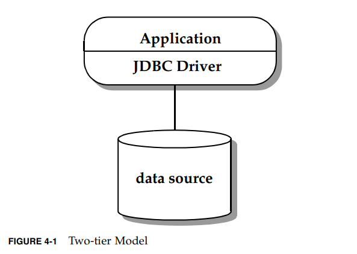
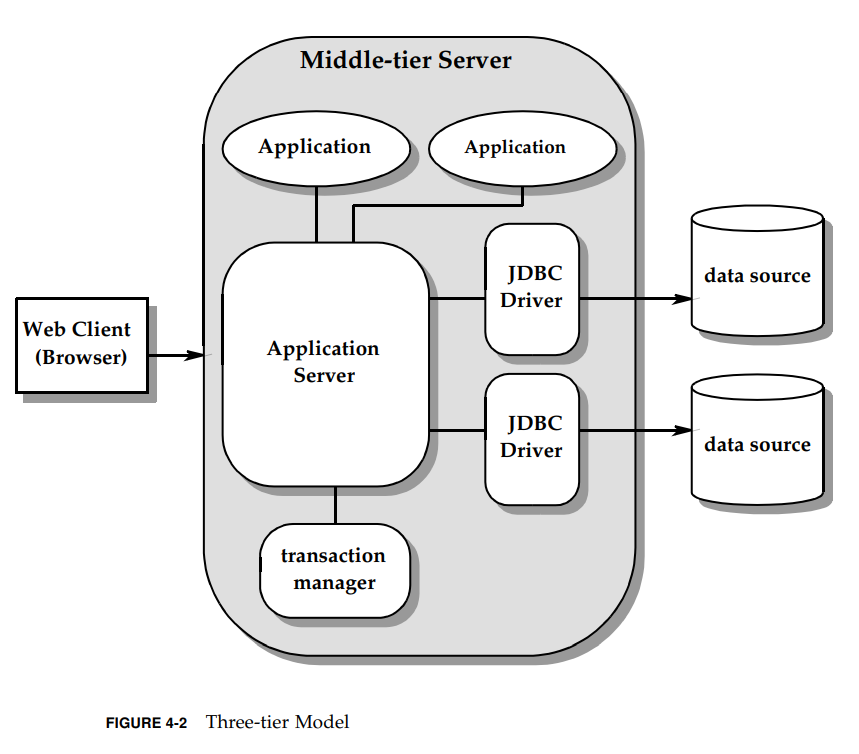

# 4.概述

JDBC API提供了一种Java语言访问一种或多种数据源的方式。大多数情况下是关系型DBMS，并且是通过
SQL访问。但是，用JDBC技术实现其他数据源的driver也是可能的，包括旧文件系统合面向对象的系统。
JDBC的主要驱动力就是提供一个标准的API，让应用程序访问各种各样的数据源。

本章介绍JDBC API的一些核心概念。另外描绘了2种通用场景，并讨论了各个实现的不同功能角色。
2层合3层模型都是逻辑配置，可以实现多种不同的物理配置。

## 4.1 建立连接

JDBC API定义了 `Connection` 接口来代表一个底层数据源的连接。

典型场景下，JDBC应用ui使用以下2种机制连接数据源：

* `DriverManager` --- 这个类JDBC1.0就有了，当第一次通过指定`URI`连接数据源时，
    `DriverManager`会自动从 `CLASSPATH` 下加载任何被找到的 JDBC driver（JDBC4.0之前的
    driver必须显式加载）
* `DataSource` --- 这个类从JDBC2.0开始可选，更推荐使用它，因为他比`DriverManager`提供了
    更多底层数据源的细节。 `DataSource`的属性可以设置不同的数据源，仅仅修改配置就可以连接
    不同的数据源，不需要修改代码。通过调用 `getConnection` 方法返回连接。

JDBC API同样提供了2个对`DataSource`的重要扩展接口来支持企业级应用：

* `ConnectionPoolDataSource` --- 支持缓存和重用物理连接来提高性能
* `XADataSource` --- 提供可用于分布式事务的连接

## 4.2 执行SQL语句和操作结果

`DatabaseMetadata`接口: 说明一个数据源是否支持一个特性。

JDBC API允许定义转义语法允许程序访问非标准特性，这是个优点。

使用 `Connection` 接口的方法指定事务属性、创建 `Statement, PreparedStatement, CallableStatement` 对象。
`Statement` 用于执行SQL语句和查询结果。
`ResultSet` 接口封装了SQL查询的结果。
语句可能是批量的，允许单条执行多个更新。

JDBC API使用`RowSet`接口扩展了 `ResultSet`接口，因此提供了一个表格化数据的容器，比结果集功能更多，更加强大。
`RowSet` 是JavaBean的组件，可以不连接数据源做操作。例如，`RowSet`可以被序列化并通过网络传输。
另外， `RowSet`的实现可以包含自定义reader来以表格格式访问任何数据，不需要是关系型数据库的数据。
还可以在断开连接时更新数据行，并自定义一个writer写回原始数据源。

### 4.2.1 对SQL高级类型的支持

JDBC API定义了高级SQL数据类型到JDBC数据类型的转换映射标准。例如SQL2003的： `BLOB, CLOB, ARRAY, REF, STRUCT, XML, DISTINCT`.

JDBC driver还可以实现自定义映射（user-defined types（UDTs）），每个UDT对应一个Java类。

JDBC同样提供对外部数据的管理，例如，数据源之外的文件里的数据。

## 4.3 两层模型
如图4-1，2层模型划分为客户端和服务端。

   

客户端：包括应用，一个或多个JDBC driver，应用程序负责以下功能：

* 展示逻辑
* 业务逻辑
* （分布式）事务管理
* 资源管理

特点：
* 应用直接和driver交互
* 可以利用非标准特性或者做些调优

缺点：
* 将表示和业务逻辑与基础设施和系统级功能相结合。这给使用定义良好的体系结构生成可维护代码带来了障碍。
* 使应用程序的可移植性降低，因为它们是针对特定的数据库实现进行调整的。需要连接到多个数据库的应用程序必须知道不同供应商实现之间的差异。
* 限制可扩展性。通常，应用程序将保留一个或多个物理数据库连接，直到它终止，从而限制了可以支持的并发应用程序的数量。
    在这个模型中，性能、可伸缩性和可用性问题由JDBC驱动程序和相应的底层数据源处理。如果应用程序处理多个驱动程序，
    它可能还需要了解每个驱动程序/数据源对解决这些问题的不同方式。

## 4.4 三层模型

如图4-2：

  

