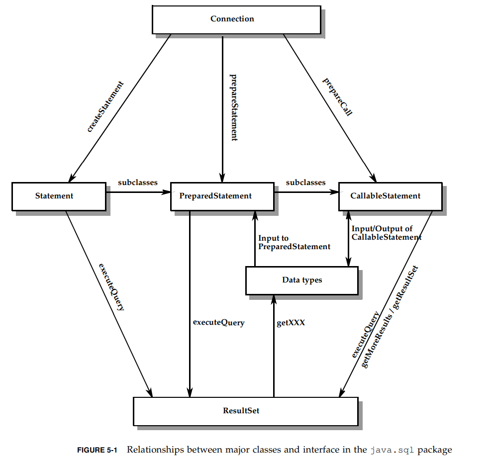
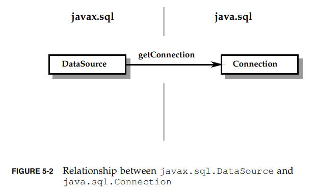
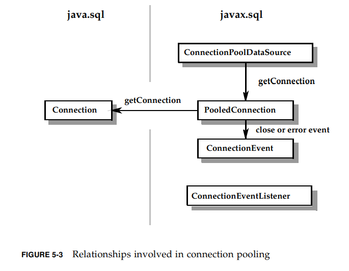
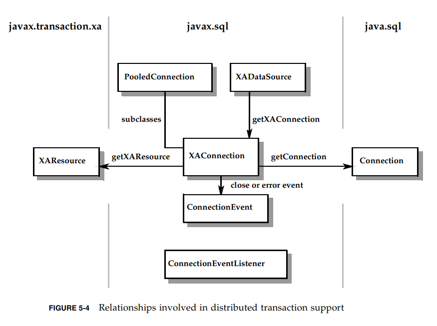
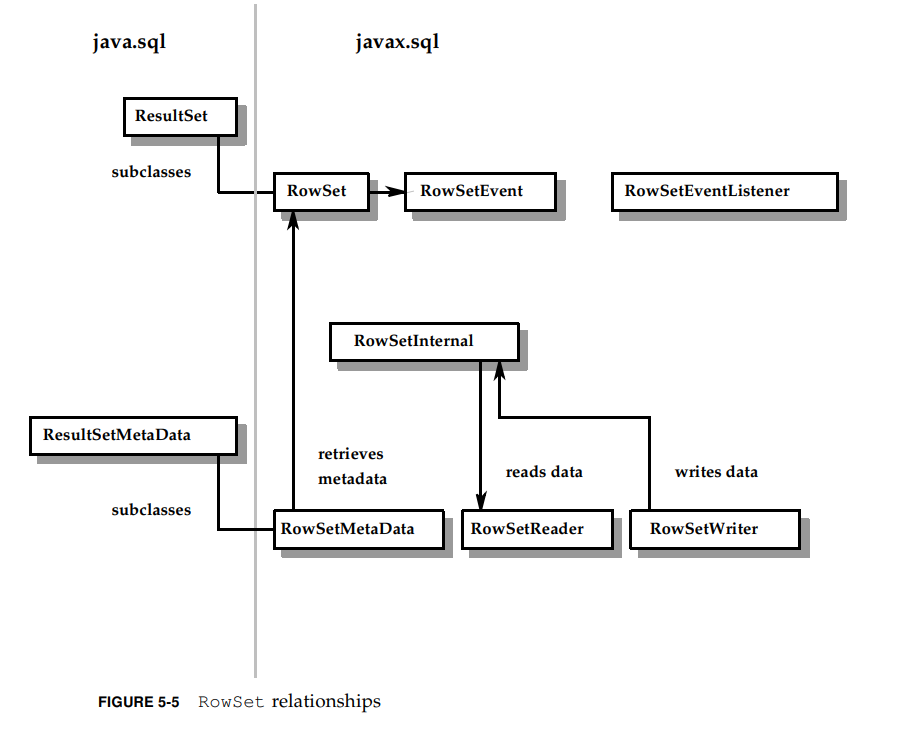

# 5.类和接口

JDBC API的类和接口的组成。

## 5.1 `java.sql`包

核心的API：枚举，类，接口(加粗的是枚举和类)。

* java.sql.Array
* **java.sql.BatchUpdateException**
* java.sql.Blob
* java.sql.CallableStatement
* java.sql.Clob
* java.sql.ClientinfoStatus
* java.sql.Connection
* java.sql.ConnectionBuilder
* **java.sql.DataTruncation**
* java.sql.DatabaseMetaData
* **java.sql.Date**
* java.sql.Driver
* java.sql.DriverAction
* **java.sql.DriverManager**
* **java.sql.DriverPropertyInfo**
* **java.sql.JDBCType**
* java.sql.NClob
* java.sql.ParameterMetaData
* java.sql.PreparedStatement
* **java.sql.PseudoColumnUsage**
* java.sql.Ref
* java.sql.ResultSet
* java.sql.ResultSetMetaData
* java.sql.RowId
* **java.sql.RowIdLifeTime**
* java.sql.Savepoint
* java.sql.ShardingKey
* java.sql.ShardingKeyBuilder
* **java.sql.SQLClientInfoException**
* java.sql.SQLData
* **java.sql.SQLDataException**
* **java.sql.SQLException**
* **java.sql.SQLFeatureNotSupportedException**
* java.sql.SQLInput
* **java.sql.SQLIntegrityConstraintViolationException**
* **java.sql.SQLInvalidAuthorizationSpecException**
* **java.sql.SQLNonTransientConnectionException**
* **java.sql.SQLNonTransientException**
* java.sql.SQLOutput
* java.sql.SQLPermission
* **java.sql.SQLSyntaxErrorException**
* **java.sql.SQLTimeoutException**
* **java.sql.SQLTransactionRollbackException**
* **java.sql.SQLTransientConnectionException**
* **java.sql.SQLTransientException**
* java.sql.SQLType
* java.sql.SQLXML
* **java.sql.SQLWarning**
* java.sql.Statement
* java.sql.Struct
* **java.sql.Time**
* **java.sql.Timestamp**
* **java.sql.Types**
* java.sql.Wrapper

下面的类和接口，要么是新增的，要么是在4.3里更新了的，新增的加粗了。

* java.sql.CallableStatement
* java.sql.Connection
* **java.sql.ConnectionBuilder**
* java.sql.DatabaseMetaData
* java.sql.Date
* java.sql.DriverManager
* java.sql.PreparedStatement
* java.sql.ResultSet
* **java.sql.ShardingKey**
* **java.sql.ShardkingKeyBuilder**
* java.sql.Statement
* java.sql.Timestamp
* javax.sql.CommonDataSource
* javax.sql.ConnectionPoolDataSource
* javax.sql.DataSource
* javax.sql.PooledConnection
* **javax.sql.PooledConnectionBuilder**
* **javax.sql.XAConnectionBuilder**
* javax.sql.XADataSource

图5-1展示了关键类接口的交互和关系，包括创建statement，设置参数和查询结果。

## 5.2 `javax.sql` 包

类被加粗：

* javax.sql.CommonDataSource
* **javax.sql.ConnectionEvent**
* javax.sql.ConnectionEventListener
* javax.sql.ConnectionPoolDataSource
* javax.sql.DataSource
* javax.sql.PooledConnection
* javax.sql.PooledConnectionBuilder
* javax.sql.RowSet
* **javax.sql.RowSetEvent**
* javax.sql.RowSetInternal
* javax.sql.RowSetListener
* javax.sql.RowSetMetaData
* javax.sql.RowSetReader
* javax.sql.RowSetWriter
* **javax.sql.StatementEvent**
* javax.sql.StatementEventListener
* javax.sql.XAConnection
* javax.sql.XAConnectionBuilder
* javax.sql.XADataSource

图5-2，5-3，5-4，5-5展示了这些类和接口之间的关系，体现在这些方面： `DataSource`对象，连接池，分布式事务， `rowset`.

