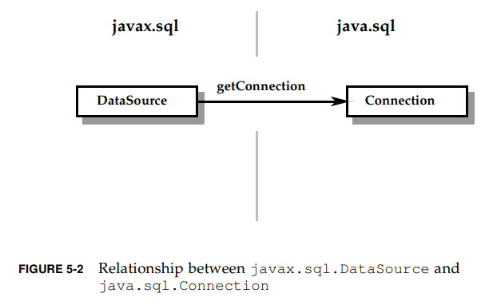
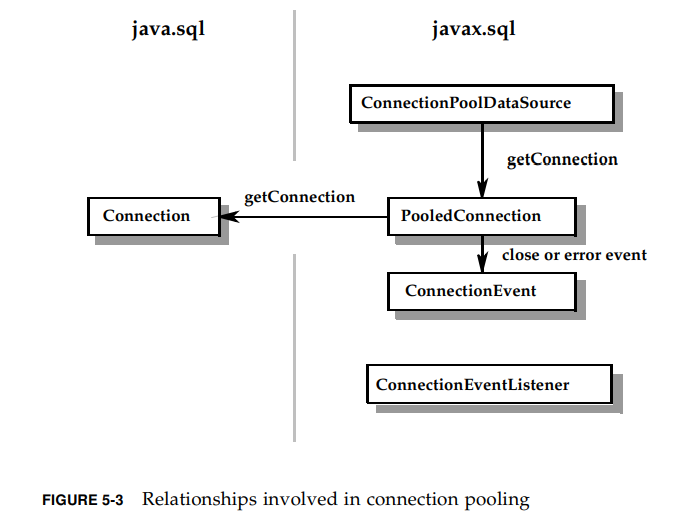
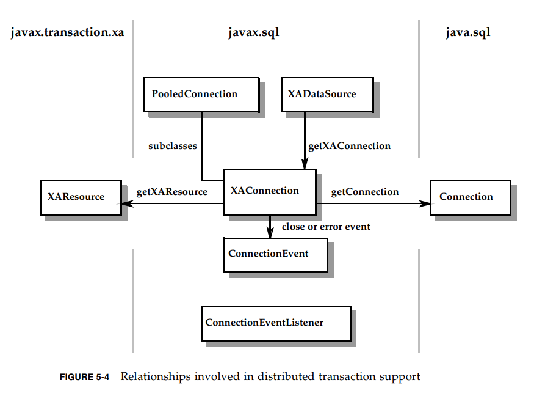
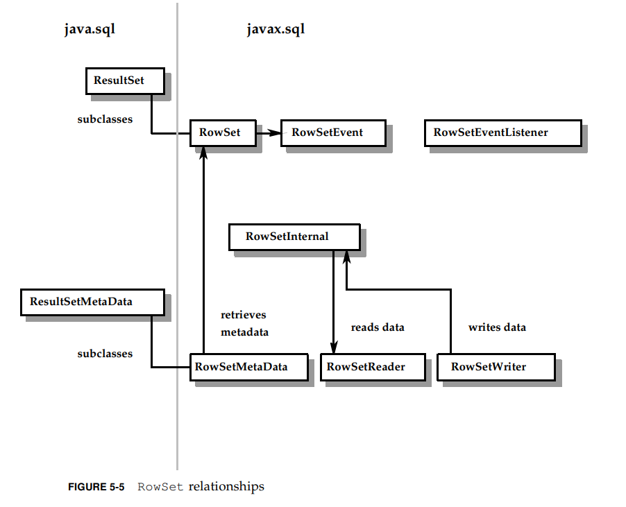

# 引言

本文件取代并合并了前面规约的内容如下：

* ■“JDBC:Java SQL API”
* ■“JDBC 2.1 API”
* ■“JDBC 2.0标准扩展API”
* ■“JDBC 3.0规范”

本文介绍了jdbc api的一系列新特性，并结合了在JDBC3.0API之前引入特性的改进。

在可能的情况下，对jdbc3.0api的任何调整都是为了更易于识别---查找JDBC4.3 API的修订和更新规范中引入的特性。

读者还可以下载JDBC类和接口的完整而精确的定义。本文件可从下载页面获得

[https://jcp.org/en/jsr/detail?id=221](https://jcp.org/en/jsr/detail?id=221)

# 1.介绍

## 1.1 JDBC API

JDBC^tm API提供了从Java编程语言对关系数据的编程访问。使用JDBC API，用Java语言编写的应用程序可以执行SQL语句、检索结果并将更改底层数据源。
JDBC API还可以用于与分布式异构环境中的多个数据源交互。

JDBC API 基于 X/Open SQL CLI，它也是ODBC的基础。JDBC提供了从Java语言到 X/Open CLI 和SQL标准中定义的抽象概念的自然且易于使用的映射。

自1997年1月引入以来，JDBC API已经被广泛接受和实现。API的灵活性允许广泛的实现。

## 1.2 平台

JDBC API是Java平台（包括Java SE，Java EE）的一部分。
JDBC API可以划分成2个包： `java.sql` 和 `javax.sql`. 2个包都包含在 Java SE 和 Java EE 平台上。

## 1.3 目标读者

该规约主要面向下面的产品提供者：

* 实现 JDBC API 的driver
* 在driver层之上提供中间件服务的应用服务
* 使用JDBC API 提供服务的工具

该规约同时出于下面的目的：

* 对使用JDBC API应用的终端用户的一个简介
* 对基于JDBC API上层API开发者的起点读物

# 2.目标

## 2.1 历史

JDBC API 第一版在1997年1月编写，是一个成熟的技术。
在初版中，旨在提供一个对SQL数据库的基础调用层接口。在2.1版中扩展了API的范围，包括支持更多高级应用，
并且提供了一些特性，代替了应用服务程序对JDBC API使用的管理。

JDBC 3.0 填充了一些小领域的缺失功能。

在4.3版本中，我们有2个目标：

1. 在Java平台上，针对所有开发者，提高更易于使用的体验；
2. 提供一些企业级特性，更丰富的工具集合API来管理JDBC资源。

## 2.2 目标概览

下面大体列出了JDBC API的目标和设计哲学，特别是4.3版本的：

1. 适应Java EE 和 Java SE平台
    JDBC API是Java平台的组成要素。JDBC4.3应该与Java平台的整体方向一致。另外，近年来Java平台新增了一系列新功能和语言提升，
    这些也被广泛地用于本规约；
2. 和SQL2003一致
    JDBC API提供了Java语言对标准SQL地语义访问。JDBC3.0保证对SQL99子集特性的支持，JDBC4.3也类似，在可预见的未来对2003标准的支持。
3. 对通用特性提供中立的访问
    JDBC API努力实现对不同厂商实现的通用支持。目标就是和程序原生实现相比提供一定程度的特性访问。同时，API必须要通用且足够灵活，才能满足
    大范围的实现。
4. 保持对SQL的专注
    JDBC API始终专注在对关系型数据的访问。和之前规约相似，也不会排除对其他技术的交互，比如XML，CORBA和非关系型数据。
5. 为工具和高级API提供基础
6. 保持简单
    简单使用，直接的接口，功能单一的方法
7. 提高可靠性，可用性和扩展性
    包括资源管理，重用prepared statement，错误处理
8. 保持向前兼容
9. 和JDBC RowSet实现保持紧密联系
10. 允许Connectors向前兼容
11. 没有歧义的规约
    哪些是必须的，哪些是可选的


# 3.新特性概述

## 3.1 改变概览

如下领域：

* 增加对`Sharding`的支持：
    `Sharding` 是一个扩容技术，允许数据被水平分区到独立的数据库
* 增加 `java.sql.ConnectionBuilder` 接口
    创建 `DataSource` 对象的接口，代表到数据库的连接建立
* 增加 `java.sql.ShardingKey` 接口
    表示这个对象是一个 `Sharding Key`
* 增加 `java.sql.ShardingKeyBuilder`接口
* 增加 `java.sql.XAConnectionBuilder` 接口
    由 `XADatasource` 创建，用来建立到一个数据库的连接
* 增加 `javax.sql.PooledConnectionBuilder` 接口
    由 `PooledConnectionDataSource` 创建
* JDBC API 的变化(是针对已有接口的改变)
    * `java.sql.Connection`
    
    TODO


# 4.概述

JDBC API提供了一种Java语言访问一种或多种数据源的方式。大多数情况下是关系型DBMS，并且是通过
SQL访问。但是，用JDBC技术实现其他数据源的driver也是可能的，包括旧文件系统合面向对象的系统。
JDBC的主要驱动力就是提供一个标准的API，让应用程序访问各种各样的数据源。

本章介绍JDBC API的一些核心概念。另外描绘了2种通用场景，并讨论了各个实现的不同功能角色。
2层合3层模型都是逻辑配置，可以实现多种不同的物理配置。

## 4.1 建立连接

JDBC API定义了 `Connection` 接口来代表一个底层数据源的连接。

典型场景下，JDBC应用ui使用以下2种机制连接数据源：

* `DriverManager` --- 这个类JDBC1.0就有了，当第一次通过指定`URI`连接数据源时，
    `DriverManager`会自动从 `CLASSPATH` 下加载任何被找到的 JDBC driver（JDBC4.0之前的
    driver必须显式加载）
* `DataSource` --- 这个类从JDBC2.0开始可选，更推荐使用它，因为他比`DriverManager`提供了
    更多底层数据源的细节。 `DataSource`的属性可以设置不同的数据源，仅仅修改配置就可以连接
    不同的数据源，不需要修改代码。通过调用 `getConnection` 方法返回连接。

JDBC API同样提供了2个对`DataSource`的重要扩展接口来支持企业级应用：

* `ConnectionPoolDataSource` --- 支持缓存和重用物理连接来提高性能
* `XADataSource` --- 提供可用于分布式事务的连接

## 4.2 执行SQL语句和操作结果

`DatabaseMetadata`接口: 说明一个数据源是否支持一个特性。

JDBC API允许定义转义语法允许程序访问非标准特性，这是个优点。

使用 `Connection` 接口的方法指定事务属性、创建 `Statement, PreparedStatement, CallableStatement` 对象。
`Statement` 用于执行SQL语句和查询结果。
`ResultSet` 接口封装了SQL查询的结果。
语句可能是批量的，允许单条执行多个更新。

JDBC API使用`RowSet`接口扩展了 `ResultSet`接口，因此提供了一个表格化数据的容器，比结果集功能更多，更加强大。
`RowSet` 是JavaBean的组件，可以不连接数据源做操作。例如，`RowSet`可以被序列化并通过网络传输。
另外， `RowSet`的实现可以包含自定义reader来以表格格式访问任何数据，不需要是关系型数据库的数据。
还可以在断开连接时更新数据行，并自定义一个writer写回原始数据源。

### 4.2.1 对SQL高级类型的支持

JDBC API定义了高级SQL数据类型到JDBC数据类型的转换映射标准。例如SQL2003的： `BLOB, CLOB, ARRAY, REF, STRUCT, XML, DISTINCT`.

JDBC driver还可以实现自定义映射（user-defined types（UDTs）），每个UDT对应一个Java类。

JDBC同样提供对外部数据的管理，例如，数据源之外的文件里的数据。

## 4.3 两层模型
如图4-1，2层模型划分为客户端和服务端。

   

客户端：包括应用，一个或多个JDBC driver，应用程序负责以下功能：

* 展示逻辑
* 业务逻辑
* （分布式）事务管理
* 资源管理

特点：
* 应用直接和driver交互
* 可以利用非标准特性或者做些调优

缺点：
* 将表示和业务逻辑与基础设施和系统级功能相结合。这给使用定义良好的体系结构生成可维护代码带来了障碍。
* 使应用程序的可移植性降低，因为它们是针对特定的数据库实现进行调整的。需要连接到多个数据库的应用程序必须知道不同供应商实现之间的差异。
* 限制可扩展性。通常，应用程序将保留一个或多个物理数据库连接，直到它终止，从而限制了可以支持的并发应用程序的数量。
    在这个模型中，性能、可伸缩性和可用性问题由JDBC驱动程序和相应的底层数据源处理。如果应用程序处理多个驱动程序，
    它可能还需要了解每个驱动程序/数据源对解决这些问题的不同方式。

## 4.4 三层模型

如图4-2：

  

1. Client: 用户交互，浏览器，PDA等，不需要关心数据底层；
2. Middle层：
    * Application：和Client交互，也通过高级API（DataSource）和数据源交互
    * Application Server：基础设施提供，比如物理连接池，事务管理。直接和JDBC Driver打交道
    * JDBC Driver：负责连接数据源
3. 底层数据源：通常的数据库DBMS

## 4.5 Java EE平台中的JDBC

JavaEE包括：JSP，Servlet，企业级Java Bean（EJB）等，这些组件需要访问JDBC时，通常通过容器，
所以不需要直接和JDBC API打交道。

# 5.类和接口

JDBC API的类和接口的组成。

## 5.1 `java.sql`包

核心的API：枚举，类，接口(加粗的是枚举和类)。

* java.sql.Array
* **java.sql.BatchUpdateException**
* java.sql.Blob
* java.sql.CallableStatement
* java.sql.Clob
* java.sql.ClientinfoStatus
* java.sql.Connection
* java.sql.ConnectionBuilder
* **java.sql.DataTruncation**
* java.sql.DatabaseMetaData
* **java.sql.Date**
* java.sql.Driver
* java.sql.DriverAction
* **java.sql.DriverManager**
* **java.sql.DriverPropertyInfo**
* **java.sql.JDBCType**
* java.sql.NClob
* java.sql.ParameterMetaData
* java.sql.PreparedStatement
* **java.sql.PseudoColumnUsage**
* java.sql.Ref
* java.sql.ResultSet
* java.sql.ResultSetMetaData
* java.sql.RowId
* **java.sql.RowIdLifeTime**
* java.sql.Savepoint
* java.sql.ShardingKey
* java.sql.ShardingKeyBuilder
* **java.sql.SQLClientInfoException**
* java.sql.SQLData
* **java.sql.SQLDataException**
* **java.sql.SQLException**
* **java.sql.SQLFeatureNotSupportedException**
* java.sql.SQLInput
* **java.sql.SQLIntegrityConstraintViolationException**
* **java.sql.SQLInvalidAuthorizationSpecException**
* **java.sql.SQLNonTransientConnectionException**
* **java.sql.SQLNonTransientException**
* java.sql.SQLOutput
* java.sql.SQLPermission
* **java.sql.SQLSyntaxErrorException**
* **java.sql.SQLTimeoutException**
* **java.sql.SQLTransactionRollbackException**
* **java.sql.SQLTransientConnectionException**
* **java.sql.SQLTransientException**
* java.sql.SQLType
* java.sql.SQLXML
* **java.sql.SQLWarning**
* java.sql.Statement
* java.sql.Struct
* **java.sql.Time**
* **java.sql.Timestamp**
* **java.sql.Types**
* java.sql.Wrapper


下面的类和接口，要么是新增的，要么是在4.3里更新了的，新增的加粗了。

* java.sql.CallableStatement
* java.sql.Connection
* **java.sql.ConnectionBuilder**
* java.sql.DatabaseMetaData
* java.sql.Date
* java.sql.DriverManager
* java.sql.PreparedStatement
* java.sql.ResultSet
* **java.sql.ShardingKey**
* **java.sql.ShardkingKeyBuilder**
* java.sql.Statement
* java.sql.Timestamp
* javax.sql.CommonDataSource
* javax.sql.ConnectionPoolDataSource
* javax.sql.DataSource
* javax.sql.PooledConnection
* **javax.sql.PooledConnectionBuilder**
* **javax.sql.XAConnectionBuilder**
* javax.sql.XADataSource

图5-1展示了关键类接口的交互和关系，包括创建statement，设置参数和查询结果。


## 5.2 `javax.sql` 包

类被加粗：

* javax.sql.CommonDataSource
* **javax.sql.ConnectionEvent**
* javax.sql.ConnectionEventListener
* javax.sql.ConnectionPoolDataSource
* javax.sql.DataSource
* javax.sql.PooledConnection
* javax.sql.PooledConnectionBuilder
* javax.sql.RowSet
* **javax.sql.RowSetEvent**
* javax.sql.RowSetInternal
* javax.sql.RowSetListener
* javax.sql.RowSetMetaData
* javax.sql.RowSetReader
* javax.sql.RowSetWriter
* **javax.sql.StatementEvent**
* javax.sql.StatementEventListener
* javax.sql.XAConnection
* javax.sql.XAConnectionBuilder
* javax.sql.XADataSource

图5-2，5-3，5-4，5-5展示了这些类和接口之间的关系，体现在这些方面： `DataSource`对象，连接池，分布式事务， `rowset`.










# 6.准则

本章确认哪些功能是JDBC driver需要实现的准则，没有说明的都是可选的。

## 6.1 定义

下面是我们的术语，避免歧义。

* JDBC Driver实现---

* 相关规约---

* 部分支持的特性---

* 扩展---

* 完全实现---

* 必须实现---

## 6.2 指南和要求

* JDBC API必须实现入门级SQL92标准+ `Drop Table` 命令
* Driver必须实现转义语法，转义语法在13章 `Statements` 描述
* Driver必须支持事务，见第十章 `事务`
* 如果 `DatabaseMetaData` 方法表明一个给定的特性要被支持，那么通过”JDBC4.3 API准则“定义的标准的语法和语义也必须支持。
    比如，如果实现支持 `RowSet`, 那么必须实现支持 `RowSetMetaData`
* Driver必须提供到底层数据源的所有访问，包括扩展的特性。
* 如果driver只实现了部分可选特性，那么需要抛出 `SQLFeatureNotSupportedException`

## 6.3 JDBC4.3 API准则

JDBC的driver必须遵循下面的规范

* 支持自动加载 `java.sql.Driver` 的实现
* 支持 `TYPE_FORWARD_ONLY` 类型的 `ResultSet`    
* 支持 `CONCUR_READ_ONLY`并发的 `ResultSet`
* 支持批量更新
* 完全实现下面的接口：
    * `java.sql.DatabaseMetaData`
    * `java.sql.ParamterMetaData`
    * `java.sql.ResultSetMetaData`
    * `java.sql.Wrapper`
* 必须实现 `DataSource` 接口并且带有异常的下面方法：
    * `getParentLogger`
* 必须实现 `Driver` 接口及其下面方法：
    * `getParentLogger`
* 必须实现 `Connection` 接口和下面的方法：
    * `createArrayOf` 除非driver支持相关的数据类型
    * `createBlob` 除非driver支持相关的数据类型
    * `createClob` 除非driver支持相关的数据类型
    * `createNClob` 除非driver支持相关的数据类型
    * `createSQLXML` 除非driver支持相关的数据类型
    * `createStruct` 除非driver支持相关的数据类型
    * `getNetworkTimeout`
    * `getTypeMap` 除非driver支持相关的数据类型
    * `setTypeMap` 除非driver支持相关的数据类型
    * `prepareStatement(String sql,Statement.RETURE_GENERATED_KEYS)`
    * `prepareStatement(String sql,int[] columnIndexes)`
    * `prepareStatement(String sql,String[] columnNames)`
    * `setSavePoint`
    * `rollback(java.sql.SavePoint savePoint)`
    * `releaseSavePoint`
    * `setNetworkTimeout`
* 必须实现 `Statement` 接口和下面的方法：
    * `cancel`    
    * `execute(String sql, Statement.RETUREN_GENERATED_KEYS)`
    * `execute(String sql, int[] columnIndexes)`
    * `execute(String sql, String[] columnNames)`
    * `executeUpdate(String sql, Statement.RETURN_GENERATED_KEYS)`
    * `executeUpdate(String sql, int[] columnIndexes)`
    * `executeUpdate(String sql, String[] columnNames)`
    * `getGeneratedKeys`
    * `getMoreResults(Statement.KEEP_CURRENT_RESULT)` 除非 `DatabasemetaData.supportsMultipleOpenResults()` 返回 `true`
    * `getMoreResults(Statement.CLOSE_ALL_RESULTS)` 除非 `DatabasemetaData.supportsMultipleOpenResults()` 返回 `true`
    * `setCursorName`
* 必须实现 `PreparedStatement` 接口和下面的方法：
    * `getMetaData`     
    * `setArray, setBlob, setClob, setNClob, setNCharacterStream, setNString, setRef, setRowId, setSQLXML and setURL`
        除非driver支持相关的数据类型
    * `setNull(int parameterIndex, int sqlType, String typeName)` 除非driver支持相关的数据类型
    * `setUnicodeStream`
    * `setAsciiStream, setBinaryStream, setCharacterStream,setNCharacterStream` 不带length参数  
* 必须实现 `CallableStatement` 接口，如果 `DatabaseMetaData.supportsStoredPrecedures()` 返回true:
    * 所有 `setXXX, getXXX` 和 `registerOutputParameter` 方法，支持 命名参数
    * `getArray, getBlob, getClob, getNClob, getNCharacterStream,
       getNString, getRef, getRowId, getSQLXML and getURL ` 除非driver支持相关的数据类型
    * `getBigDecimal(int patameterIndex, int scale)`
    * `getObject(int i,Class<T> type)`
    * `getObject(String colName, Class<T> type)`
    * `getObject(int parameterIndex, java.util.Map<java.lang.String,java.lang.Class<T>> map)` 除非driver支持相关的数据类型
    * `registerOutputParam(String parameterName, int sqlType, String typeName)` 除非driver支持相关的数据类型
    * `setNull(String parameterName, int sqlType, String typeName)` 除非driver支持相关的数据类型
    * `setAsciiStream, setBinaryStream, setCharacterStream,
       setNCharacterStream ` 不带length参数  
* 必须实现 `ResultSet` 接口和下面的方法：
    * 所有 `updateXXX` 方法
    * `absolute`    
    * `afterLast`
    * `beforeFirst`
    * `cancelRowUpdates`
    * `deleteRow`
    * `first`
    * `getArray, getBlob, getClob, getNClob, getNCharacterStream,
       getNString, getRef, getRowId, getSQLXML and getURL ` 除非driver支持相关的数据类型
    * `getBigDecimal(int i, int scale)`
    * `getBigDecimal(String colName, Class<T> type)`
    * `getCursorName`
    * `getObject(int i, Class<T> type)`
    * `getObject(String colName, Class<T> type)`
    * `getObject(int i,Map<String, Class<?>> map)` 除非driver支持相关的数据类型
    * `getObject(String colName,Map<String, Class<?>> map)` 除非driver支持相关的数据类型
    * `getRow`
    * `getUnicodeStream`
    * `insertRow`
    * `isAfterLast`
    * `isBeforeFirst`
    * `isFirst`
    * `isLast`
    * `last`
    * `moveToCurrentRow`
    * `moveToInsertRow`
    * `previous`
    * `refreshRow`
    * `relative`
    * `rowDeleted`
    * `rowInserted`
    * `rowUpdated`
    * `updateRow`
* 如果要支持 并发的 `CURSOR_UPDATABLE`的 `ResultSet`, 那么下面的方法要被实现
    * 所有的 `updateXXX` 方法，除了 `updateArray, updateBlob,updateClob, updateNClob, updateNCharacterstream, 
    updateNString,updateRef, updateRowId, updateSQLXML and updateURL`, 和带有length参数的 `updateBlob, updateClob,
    updateNClob, updateAsciiStream, updateBinaryStream,updateCharacterStream and updateNCharacterstream`
    * `cancelRowUpdates`
    * `deleteRow`
    * `rowDeleted`
    * `rowUpdated`
    * `updateRow`
* 如果JDBC driver支持 `TYPE_SCROLL_SENTITIVE, TYPE_SCROLL_INSENSITIVE` 类型的 `ResultSet`, 下面的方法要实现：
    * `absolute`
    * `afterLast`
    * `beforeFirst`
    * `first`
    * `isAfterLast`
    * `isBeforeFirst`
    * `isFirst`
    * `isLast`
    * `last`
    * `previous`
    * `relative`
* 如果一个可选的接口被实现，那么所有的方法也应该被完全实现
    * `java.sql.SQLInput, java.sql.SQLOutput`不要求实现 `Array, Blob, Clob, NClob, NString, Ref,RowId, SQLXML and URL `类型

## 6.4 Java EE JDBC准则

TODO

# 7.数据库元数据

主要针对 `DatabaseMetaData` 接口，该接口包括超过150个方法，可以归为以下几类：

* 数据源的同用信息
* 数据源是否支持给定的特性
* 数据源限制
* 数据源包含的SQL对象，以及这些对象包含的属性
* 数据源提供的事务支持


`DatabaseMetaData` 接口同时包含超过40个字段，作为常量用来返回不同方法的值。

## 7.1 创建 `DatabaseMetaData` 对象

`DatabaseMetaData`对象由 `Connection` 创建，一旦创建，可以动态发现数据源信息的变化。
如下例子：

```java
DatabaseMetaData dbml = con.getMetaData();
int maxLen = dbmd.getMaxTableNameLength();
```

## 7.2 查询通用信息

查询数据源通用信息方法：

* `getURL`
* `getUserName`
* `getDatabaseProductVersion,getDriverMajorVersion,getDriverMinorVersion`
* `getSchemaTerm, getCatalogTerm, getProcedureTerm`
* `nullsAreSortedHigh , nullsAreSortedLow`
* `usedLocalFiles, usesLocalFilePerTable`
* `getSQLKeywords`

## 7.3 确定支持的特性

很多方法是：确定数据源支持哪些功能，支持的功能到什么级别

* `supportsAlterTableWithDropColumn`
* `supportsBatchUpdates`
* `supportsTableCorrelationNames`
* `supportsPositionedDelete`
* `supportsFullOuterJoins`
* `supportsStoredProcedures`
* `supportsMixedCaseQuotedIdentifiers`

描述支持功能到哪个级别的方法：

* `supportsANSI92EntryLevelSQL`
* `supportsCoreSQLGrammar`

## 7.4 数据源的限制

数据源的限制

* `getMaxRowSize`
* `getMaxStatementLength`
* `getMaxConnections`
* `getMaxCharLiteralLength`
* `getMaxColumnsInTable`

上述方法都返回int，返回0代表没有限制或未知。

## 7.5 SQL对象和对象属性

`DatabaseMetaData`的方法会提供一个数据源的SQL对象信息。比如，`getUDTs`方法返回一个 `ResultSet` 对象，每一行都是一个UDT。

* `getSchemas`
* `getCatalogs`
* `getTables`
* `getPrimaryKeys`
* `getProcedures`
* `getProceduresColumns`
* `getUDTs`
* `getFunctions`
* `getFunctionColumns`

## 7.6 事务支持

数据库支持的事务语义

* `supportsMultipleTransactions`
* `getDefaultTransactionIsolation`

## 7.7 新方法

JDBC 4.3版的新方法

* `supportsSharding` --- 是否driver和数据库支持 sharding

完整定义见 Java doc

## 7.8 修改的方法

4.3修改了已有的方法：

* `getTables` --- 澄清了 `REMARKS` 列可能返回null

# 8.异常

`SQLException`类和子类，关于在处理数据过程中的错误和警告。

## 8.1 SQLException

异常包含以下信息：

* `SQLException.getMessage` 返回异常信息
* `getSQLState`：SQl状态依赖于底层数据源，X/Open和SQL:2003 都有定义，有些重叠。
* `getErrorCode`, 错误码：一个整型，从底层数据源发出
* `cause`: Throwable对象
* `getNextException`: 链式异常，没有了返回null

有很多子类异常，在8.5节描述。

### 8.1.1 对Java SE链式异常的支持

`SQLException` 支持链式异常，通过以下改变：

* 增加4个构造方法，增加 cause参数
* 支持增强的 For-Each循环遍历异常
* `getCause` 方法可能返回非 `SQLException` 的异常

### 8.1.2 遍历SQLException异常

有可能异常的根源不是 SQLException，可以溯源查找，如下：

```java
catch(SQLException ex) {
 while(ex != null) {
 System.out.println("SQLState:" + ex.getSQLState());
 System.out.println("Error Code:" + ex.getErrorCode());
 System.out.println("Message:" + ex.getMessage());
 Throwable t = ex.getCause();
 while(t != null) {
 System.out.println("Cause:" + t);
 t = t.getCause();
 }
 ex = ex.getNextException();
 }
}
```

#### 8.1.2.1 使用For-Each循环遍历异常

```java
catch(SQLException ex) {
 for(Throwable e : ex ) {
 System.out.println("Error encountered: " + e);
 }
}
```

## 8.2 SQLWarning

SQLWarning是SQLException的子类，以下接口可能发出警告：

* Connection
* DataSet
* Statement
* ResultSet

当查询SQLWarning时 `getWarnings`被调用。

也有 `getNextWarning` 方法。

## 8.3 DataTruncation

是 SQLWarning 的子类，当数据被截断时提供信息。

当数据被写入数据库时有可能截断，比如超过字段长度。

DataTruncation包括以下信息：

* 描述的String
* 当读取数据源时发生截断抛出 `01004`的SQLState
* 当写入数据源时发生截断抛出 `22001`的SQLState
* boolean字段标识列值是否被截断， 如果参数被截断则`getParameter` 返回true，如果列被截断返回false
* `getIndex`返回int，表示被截断的列或参数的索引，否则返回 -1，如果未知索引，返回undefined
* `getRead`返回boolean类型标识截断是否发生在读取或写入过程中
* `getDataSize`返回整型标识应该被传输的数据字节数，可能是个近似值，未知返回-1
* `getTransferSize` 返回int标识实际被传输了的字节数，未知返回-1

### 8.3.1 安静的截断

 `Statement.setMaxFieldSize` 方法允许一个最大值（字节），这个限制仅用在 `BINARY, VARBINARY, LONGVARBINARY, CHAR, 
 VARCHAR, LONGVARCHAR, NCHAR, NVARCHAR, and LONGNVARCHAR` 数据类型。
 
 如果使用了 `setMaxFieldSize` 设置限制并且读取数据时超过了这个限制，发生了任何截断都不会报错。
 
 ## 8.4 BatchUpdateException
 
 批量更新异常，批量更新在 14章描述。
 
 ## 8.5 分类异常
 
 就是和SQLState不相关的异常，如下分类：
 
 * `SQLNonTransientException`
 * `SQLTransientException`
 * `SQLRecoverableException`
 
 ### 8.5.1 NonTransientException
 
 继承 `SQLNonTransientException` 的异常， TODO
 
 表8-1
 
 | SQL State 类 | SQLNonTransientException子类 |
 | --- | --- |
 | 0A | SQLFeatureNotSupportedException |
 | 08 | SQLNonTransientConnectionException |
 | 22 | SQLDataException |
 | 23 | SQLIntegrityConstraintViolationException |
 | 28 | SQLInvalidAuthorizationException |
 | 42 | SQLSyntaxErrorException |
 
 ### 8.5.2 Transient SQLException
 
 继承 `SQLTransientException` 的异常。 TODO
 
 表8-2
 
  | SQL State 类 | SQLTransientException子类 |
  | --- | --- |
  | 08 | SQLTransientConnectionException |
  | 40 | SQLTransactionRollbackException |
  | N/A | SQLTimeoutException |
  
### 8.5.3 SQLRecoverableException  

就是如果程序做一些操作和重试可能会成功，当抛出这个异常时，表明连接已经不可用了，应用需要关闭当前连接并新建一个。

## 8.6 SQLClientInfoException

当 `Connection.setClientInfo` 时抛出。表名哪些客户端参数没有被设置。


# 9.连接

`Connection` 代表一个数据源连接。一个应用可能持有很多连接。数据源也可能有多个。

从JDBC driver的角度，Connection代表一个客户端的session，带有状态信息，比如 user ID，SQL Statement和ResultSet，事务语义等。

获取一个连接：

* `DriverManager`: 一个或多个 `Driver` 实现
* `DataSource` 实现

倾向于使用 `DataSource`,因为它更方便，维护简洁，可以透明的使用连接池和分布式事务。

本章描述不同种类的JDBC Driver和Driver接口，DriverManager, DataSource的使用. 11章讲连接池，12章讲分布式事务。

## 9.1 Driver的类型

Driver有很多类型，下面归为几类：

* 类型1：实现 JDBC API到其他数据访问API的映射，通常依赖原生库，会限制便捷性，比如 `JDBC-ODBC` 桥接Driver。
* 类型2：一部分是Java代码实现的，一部分是原生代码实现的。通用由于原生代码，部分便捷性受限。
* 类型3：driver完全由Java实现，但是是和一个中间件连接，采用独立于数据库的协议，中间件负责代理客户端的请求到数据源。
* 类型4：完全由Java实现，包括网络，文件I/O。客户端直接和数据源连接。

## 9.2 Driver接口

JDBC Driver必须实现Driver接口，而且必须有一个静态初始化，在driver被调用时加载。
这个初始化使用DriverManager注册driver自身的实例，如下代码：

```java
public class AcmeJdbcDriver implements java.sql.Driver {
    static {
        java.sql.DriverManager.registerDriver(new AcmeJdbcDriver());
    }
    ...
}
```

为了保证driver可以被加载，driver必须要一个**无参构造方法**.

Driver接口包含 `acceptsURL` 方法，声明可以接受的 URL格式。

当 `DriverManger` 想创建一个连接时，会调用 driver的 `connect` 方法。driver应该返回一个 `Connection` 对象或者抛出
SQLException（不能连上数据库时）。如果是driver不接收的URL，返回null。

### 9.2.1 加载一个实现了 java.sql.Driver接口的driver

在初始化时，DriverManager会尝试加载可用的 JDBC driver，通过以下方式：

* `jdbc.drivers`的系统属性，值是全限定类名，每个driver通过系统类加载器加载
* 通过 SPI机制发现 `java.sql.Driver` 的实现类

例子：
```shell script
java -Djdbc.drivers=com.acme.jdbc.AcmeJdbcDriver Test
```

> 注意，初始化是个懒加载过程，取决于服务提供使用的线程上下文的类加载器

当 `DriverManager.getConnection` 被调用时， `DriverManager` 会尝试定位一个合适的driver，从那些初始化的地方。

> 注意：现有的应用继续使用 `Class.forName()` 加载driver可以继续使用


## 9.3 DriverAction接口

当driver想被通知`DriverManager.deregisterDriver`时使用.

`DriverAction` 的实现不应该被应用直接调用，应该创建为一个私有类避免。

使用方式：在初始化时把实现传进去：

```java
public class AcmeJdbcDriver implements java.sql.Driver {
    static DriverAction da;
    static {
        java.sql.DriverManager.registerDriver(new AcmeJdbcDriver(), da);
    }
    ...
}
```

## 9.4 DriverManager类

管理driver的类。当请求输入一个URL，DriverManager返回一个连接。

关键方法如下：

* `registerDriver`: 被隐式调用，加载可用driver集合。被各个driver的静态初始化调用。
* `getConnection`: JDBC client调用，来获取一个连接，包括一个传给DriverManager的URL，被Driver的connect方法识别，
    driver负责返回一个连接对象给DriverManager，然后再返回给应用

JDBC URL的格式：

* `dbc:<subprotocal>:<subname>`    

`subprotocal`定义了数据库连接机制的类型。`subname` 取决于 `subprotocal`.

> 注意：JDBC URL 不要求完全实现RPC3986的URI语法

代码9-4：如何从DriverManager获取一个连接

```java
// Set up arguments for the call to the getConnection method.
// The sub-protocol "derby" in the driver URL indicates the
// use of the derby JDBC driver.
String url = "jdbc:derby:sample";
String user = "SomeUser";
String passwd = "SomePwd";
// Get a connection from the first driver in the DriverManager
// list that recognizes the URL "jdbc:derby:sample".
// The call to geConnection will also load the driver if needed.
// When the driver is loaded, an instance of the driver is created
// and the registerDriver method is also called to make the driver
// available to clients.
Connection con = DriverManager.getConnection(url, user, passwd);
```

DriverManager的另外2个获取连接方法：

* `getConnection(String url)`: 无需用户名密码
* `getConnection(String url, java.util.Properties prop)`: 允许客户端传一些列参数

同样 `DriverPropertyInfo` 类也可以剔红JDBC driver能够理解的参数

## 9.5 SQLPermission 类

代表代码库权限授权。

目前仅有的权限是 `setLog`. 没有`setLog`权限会抛出 `java.lang.SecurityException`

## 9.6 DataSource接口

DataSource从JDBC2.0开始作为可选包出现，是获取连接的推荐方式。
相比于DriverManager通过driver来指定数据源信息，DataSource通过逻辑名称来映射数据源，逻辑名称通过 JNDI的命名服务
来映射到数据源。如果数据源的属性改变了，那么可以很容易的反应出来，不需要应用代码的改变。

实现DataSource可以透明的提供以下部分：

* 通过连接池增加性能和扩展性
* 通过 `XADataSource` 接口支持分布式事务

> 注意：DataSource的实现必须包含无参构造

下面3节讨论：
1. 基础DataSource属性
2. 如何使用JNDI实现逻辑名称来提高程序便捷性和可维护性
3. 如何获得一个连接

### 9.6.1 DataSource属性

下表9-1描述了标准 `DataSource` 的属性

| 属性名 | 类型 | 描述 |
| --- | --- | --- |
| databaseName | String | 服务器上数据库的名字 |
| dataSourceName | String | 数据源名字，用来命名 XADataSource或ConnectionPoolDataSource |
| description | String | 描述 |
| networkProtocol | String | 网络协议 |
| password | String | 数据库密码 |
| portNumber | int | 数据库端口 |
| roleName | String | 初始SQL角色 |
| serverName | String | 数据库服务的名称 |
| user | String | 用户名 |

对每个属性需要 `getter,setter` 方法。在初始化时赋值：

```java
VendorDataSource vds = new VendorDataSource();
vds.setServerName("my_database_server");
String name = vds.getServerName();
```

DataSource的属性不打算直接让JDBC client访问。管理工具可以通过反射获取。

### 9.6.2 JNDI API和应用便捷性

JNDI(Java Naming and Directory Interface) API提供了一个通过的方法让应用通过网络访问远程服务。
本章描述如何注册和访问 JDBC `DataSource`.

通过指定逻辑名称可以使用JNDI API访问 DataSource对象。一个命名服务通过名称映射数据源。
这种格式极大的提高了便捷性，因为任何数据源的属性修改（比如端口或服务名）都不会影响客户端代码。
事实上，应用可以完全透明的被重定向到一个不同的数据源。
在3层环境下尤其有用，就是应用服务隐藏了访问不同数据源的细节。

代码9-6描述了基于JNDI的命名服务来部署一个 `VendorDataSource`对象的使用：

```java
// Create a VendorDataSource object and set some properties
VendorDataSource vds = new VendorDataSource();
vds.setServerName("my_database_server");
vds.setDatabaseName("my_database");
vds.setDescription("data source for inventory and personnel");
// Use the JNDI API to register the new VendorDataSource object.
// Reference the root JNDI naming context and then bind the
// logical name "jdbc/AcmeDB" to the new VendorDataSource object.
Context ctx = new InitialContext();
ctx.bind("jdbc/AcmeDB", vds);
```

> 注意：细节可以参考Java EE规范的第5章：Naming

### 9.6.3 使用DataSource创建一个连接

如下代码：

```java
// Get the initial JNDI naming context
Context ctx = new InitialContext();
// Get the DataSource object associated with the logical name
// "jdbc/AcmeDB" and use it to obtain a database connection
DataSource ds = (DataSource)ctx.lookup("jdbc/AcmeDB");
Connection con = ds.getConnection("user", "pwd");
```

查找不同的数据源时只需要修改名称。

### 9.6.4 关闭连接

`Connection.close(), Connection.isClosed(), Connection.isValid()`

#### 9.6.4.1 Connection.close

断开连接之后，除了上面3个方法的访问，都应该抛出 `SQLException` 异常。

#### 9.6.4.2 Connection.isClosed

是否连接被关闭，不能用来验证连接是否合法。

#### 9.6.4.3 Connection.isValid

连接不合法用此方法，不合法都该抛异常。


# 10.事务

所有JDBC规范的driver都要求提供事务的支持。在SQL：2003规范包括下面的概念：

* 自动提交模式
* 事务隔离模式
* 保存点（Savepoints）

本章讨论单个Connection的事务语义。多个Connection的事务在 12章 分布式事务讨论。

## 10.1 事务边界与自动提交

# 11.连接池

在基础版的DataSource实现中，连接和物理数据库是1对1的，当连接关闭，物理连接就被抛弃了。
因此，每个客户端session都会开启、初始化、关闭物理连接。

连接池通过保存一些能够复用的数据库的物理连接缓存来解决这个问题。连接池极大的提高了性能和扩展性，特别是在三层模型里。
在图11-1中，JDBC driver提供了一个 `ConnectionPoolDataSource`的实现以便应用服务用来创建和管理连接池。


接下来章节介绍 `ConnectionPoolDataSource, PooledConnection, ConnectionEvent`接口和类。
描述了基础数据源和连接池数据源的一些重要的区别。另外，还讨论了连接池如何能够管理可重用的 `PreparedStatement`对象。

## 11.1 ConnectionPoolDataSource和PooledConnection

通常JDBC driver实现ConnectionPoolDataSource接口，然后应用使用它来创建PooledConnection对象。

代码11-1展示了2个版本的 `getPooledConnection` 接口

```java
public interface ConnectionPoolDataSource {
    PooledConnection getPooledConnection() throws SQLException;
    PooledConnection getPooledConnection(String user, String password) throws SQLException;
    ...
}
```

一个 `PooledConnection` 代表一个到数据库的物理连接。JDBC Driver的实现封装了管理这个连接的所有细节。

当一个客户端调用 `DataSource.getConnection`方法，应用服务使用物理的 `PooledConnection`对象来获得一个逻辑的
`Connection`对象。11-2代码展示了 `PooledConnection` 接口定义

```java
public interface PooledConnection {
    Connection getConnection() throws SQLException;
    void close() throws SQLException;
    void addConnectionEventListener(ConnectionEventListener listener);
    void addStatementEventListener(StatementEventListener listener);
    void removeConnectionEventListener(ConnectionEventListener listener);
    void removeStatementEventListener(StatementEventListener listener);
}
```

当一个应用使用完一个连接，它调用 `Connection.close`关闭一个逻辑连接。但是不会关闭物理连接，物理连接被归还给
连接池。

连接池对客户端透明，是否有连接池对客户端使用无感。

> 注意：当 `Connection.close`被调用，池子里的任何通过 `Connection.setClientInfo`设置的属性都会清空

## 11.2 连接事件

当连接关闭时，要通知连接池管理者回收连接。可以实现 `ConnectionEventListener`接口。
该接口定义了2个方法来响应2类事件：

* `connectionClosed`---当调用 `Connection.close`时触发
* `connectionErrorOccurred`---当严重错误（例如服务器崩溃）导致连接丢失

一个连接池管理者通过 `PooledConnection.addConnectionEventListener`方法将自己注册成监听器。
在返回Connection给应用之前注册。

当相关事件发生时，driver来调用 `ConnectionEventListener`的方法。2个方法都有一个 `ConnectionEvent`参数，可以
用来确定是哪种事件。当连接关闭时，driver通过调用 监听器的`connectionClosed`来通知连接池管理者。

当错误发生时，driver通过调用监听器的 `connectionErrorOccurred`方法来通知监听器并且抛出 `SQLException`.

## 11.3 在三层环境中的连接池

下面描述了使用连接池实现时，一个请求如何从DataSource中获取一个连接。

* 客户端调用 `DataSource.getConnection`
* DataSource的实现从他的连接池里寻找，看有没有合适的 `PooledConnection` 对象---一个可用的物理连接。
    如何决定合适的对象？通过匹配客户端的用户认证信息或应用类型或其他特殊实现标准。这个寻找方法及其相关方法是特定于应用服务的。
* 如何没有合适的 `PooledConnection`对象，应用服务就调用 `ConnectionPoolDataSource.getPooledConnection`方法获取一个新的
    物理连接，这个过程由 JDBC driver实现。    
* 一旦连接获取到了，应用服务就做一些内部记账来表明这个连接正在使用了
* 应用服务调用 `PooledConnection.getConnection` 来获取一个逻辑连接对象。逻辑连接就是物理连接的一个”处理“
* 应用服务通过调用 `PooledConnection.addConnectionEventListener`方法将自己注册为一个 `ConnectionEventListener`.
    这样就可以在连接对象可用时得到通知。
* 逻辑连接被返回给JDBC 客户端，就和使用基础 `DataSource` 的Connection一样。注意，底层的 `PooledConnection`对象不能被重用，直到客户端调用了
    `Connection.close`方法

连接池同样可被2层模型实现，这样 JDBC driver就需要同时实现 `DataSource` 和底层的 `ConnectionPoolDataSource`.

## 11.4 DataSource实现和连接池化

除了提高性能和扩展性，对JDBC应用暴露的DataSource接口不应该有任何不同，不管有没有池化。
然而，driver端实现肯定是不同的。

几个基础的没有池化的DataSource实现过程如下：

* `DataSource.getConnection` 方法创建一个新的Connection对象代表一个物理连接，封装了所有设置和管理这个连接的细节
* `Connection.close`会关闭这个连接并释放相关资源

在池化的DataSource实现过程如下：

* 池化的DataSource实现需要管理一个 `PooledConnection` 的对象缓存池。一般实现 `ConnectionPoolDataSource`和`PooledConnection`接口
* `DataSource.getConnection`方法调用 `PooledConnection.getConnection`获取一个逻辑连接，对物理连接的设置仅发生在没有物理连接时。
    当需要新的物理连接时，连接池管理器通过调用 `ConnectionPoolDataSource.getPooledConnection`创建一个。
* `Connection.close`方法关闭逻辑连接，但保留物理连接，如果应用试图复用逻辑连接，抛出 `SQLException`
* 一个物理连接可能产生很多逻辑链接，但只有最近产生的逻辑连接才有效，许多之前存在的逻辑连接需要在 `PooledConnection.getConnection`时
    自动关闭。    
* 连接池管理器通过调用 `PooledConnection.close`来关闭一个物理连接，只会发生在特定情况：应用服务正在关闭，连接池缓存在重新初始化，或者
    应用服务收到在连接时发生不可恢复的错误的事件


## 11.5 开发

开发带连接池的DataSource对象需要一个对客户端可见的DataSource和一个通过JNDI注册的ConnectionPooledDataSource服务。

第一步就是开发 `ConnectionPoolDataSource`

```java
// ConnectionPoolDS implements the ConnectionPoolDataSource
// interface. Create an instance and set properties.
com.acme.jdbc.ConnectionPoolDS cpds = new com.acme.jdbc.ConnectionPoolDS();
cpds.setServerName(“bookserver”);
cpds.setDatabaseName(“booklist”);
cpds.setPortNumber(9040);
cpds.setDescription(“Connection pooling for bookserver”);
// Register the ConnectionPoolDS with JNDI, using the logical name
// “jdbc/pool/bookserver_pool”
Context ctx = new InitialContext();
ctx.bind(“jdbc/pool/bookserver_pool”, cpds);
```

然后 DataSource的实现就依赖于池化的DataSource

```java
// PooledDataSource implements the DataSource interface.
// Create an instance and set properties.
com.acme.appserver.PooledDataSource ds = new com.acme.appserver.PooledDataSource();
ds.setDescription(“Datasource with connection pooling”);
// Reference the previously registered ConnectionPoolDataSource
ds.setDataSourceName(“jdbc/pool/bookserver_pool”);
// Register the DataSource implementation with JNDI, using the logical
// name “jdbc/bookserver”.
Context ctx = new InitialContext();
ctx.bind(“jdbc/bookserver”, ds);
```

## 11.6 通过连接池重用Statement

JDBC规范提供对Statement的池化支持，允许应用重用 `PreparedStatement`对象。

图11-2提供了一个逻辑视图：一池子PreparedStatement如何和PooledConnection对象关联。


### 11.6.1 使用池化的Statement

同样的，使用池化的和没池化的PreparedStatement对客户端应该完全一样，也就是透明。

应用可以通过调用 `DatabaseMetaData.supportsStatementPooling`确定是否支持池化。

池化是个重大的优化，特别是statement很复杂时，但是也要注意开放的statement对资源的占用。

### 11.6.2 关闭池化的Statement

以下方法可以关闭一个池化的statement：

* `Statement.close`---应用调用，只关闭这个statement
* `Connection.close`---由应用调用
    * 非池化的连接---关闭物理连接和由连接创建的所有statement
    * 池化的连接---关闭逻辑连接和相关的statement
* `PooledConnection.close`---由连接池管理器调用。关闭了物理连接，相关的资源全玩完。    

一个应用不能直接关闭被池化的物理连接，必须由连接池管理器来。

应用同样无法插手statement如何被池化。池化的statement是和PooledConnection相关的，PooledConnection又是由
ConnectionPooledDataSource的属性决定的。

## 11.7 Statement事件

池化的statement的事件，必须实现 `StatementEventListener`并被注册。有下面2类事件：

* `statementClosed`---当 PooledConnection被关闭，也就是 PreparedStatement.close被调用
* `statementErrorOccurred`---检测到PreparedStatement对象不再合法。

通过 `PooledConnection.addStatementEventListener`注册自己为一个监听者。

## 11.8 ConnectionPoolDataSource属性

JDBC定义了一系列属性配置连接池的行为。

| 属性名 | 类型 | 描述 |
| --- | --- | --- |
| maxStatements  |  int | 连接池允许保持statement开放的总数，0代表不池化  |
| initialPoolSize  | int  | 当创建时应该包含的物理连接数量  |
| minPoolSize  | int  | 总是存在可用的物理连接的数量，0表名根据需要创建  |
| maxPoolSize  | int  | 最大可包含的物理连接数量，0代表没有最大  |
| maxIdleTime  | int  | 在连接被关闭时物理连接保持未被使用的秒数，0代表没有限制  |
| propertyCycle  |  int |   |

设置配置的代码示例：

```java
VendorConnectionPoolDS vcp = new VendorConnectionPoolDS();
vcp.setMaxStatements(25);
vcp.setInitialPoolSize(10);
vcp.setMinPoolSize(1);
vcp.setMaxPoolSize(0);
vcp.setMaxIdleTime(0);
vcp.setPropertyCycle(300); 
```

连接池参数不应该直接由客户端访问，应该由管理工具来操作。


# 12.分布式事务

TODO

# 13.Statements

本章描述 Statement接口和子类PreparedStatement，CallableStatement。
同时包括语法转义，性能提示和自动生成键。

## 13.1 Statement接口

Statement接口定义了执行SQL语句的方法，不包含参数构造，PreparedStatement包含参数构造，
CallableStatement添加了从存储过程返回输出参数的方法。

## 13.1.1 创建Statement

创建代码如下所示：

```java
Connection conn = dataSource.getConnection(user, passwd);
Statement stmt = conn.createStatement()
```

每个连接可以创建多个statement

```java
// get a connection from the DataSource object ds
Connection conn = ds.getConnection(user, passwd);
// create two instances of Statement
Statement stmt1 = conn.createStatement();
Statement stmt2 = conn.createStatement();
```

#### 13.1.1.1 设置ResultSet配置

可以通过statement设置resultSet的参数，比如：类型，并发，持有性。例如代码：

```java
Connection conn = ds.getConnection(user, passwd);
Statement stmt = conn.createStatement(
    ResultSet.TYPE_SCROLL_INSENSITIVE,
    ResultSet.CONCUR_UPDATABLE,
    ResultSet.HOLD_CURSORS_OVER_COMMIT);
```

### 13.1.2 执行 Statement对象

执行时要判断语句的类型，如果是SQL查询语句，那么返回一个ResultSet对象，使用 `executeQuery`方法。
如果是一个DDL或DML语句，返回更新的条数，使用 `executeUpdate`. 如果语句类型未知，使用 `execute`方法。

#### 13.1.2.1 返回ResultSet对象

示例代码：

```java
Statement stmt = conn.createStatement();
ResultSet rs = stmt.executeQuery("select TITLE, AUTHOR, ISBN from BOOKLIST");
while (rs.next()){
    ... 
}
```

如果执行没有返回ResultSet，那么抛出 `SQLException` 异常。

#### 13.1.2.2 返回更新数量

对于DML语句，返回更新的行数或0：

```java
Statement stmt = conn.createStatement();
int rows = stmt.executeUpdate("update STOCK set ORDER = 'Y' where SUPPLY = 0");
if (rows > 0) {
    ...
}
```

如果SQL语句执行返回`ResultSet`, `executeUpdate`方法抛出 `SQLException`

> 注意：如果返回的行数比Integer.MAX_VALUE还大，使用 `executeLargeUpdate`方法

#### 13.1.2.3 返回未知或多个结果

如果有多个结果，或直到运行时才知道类型、返回的行数，那应该用 `execute` 方法。
`getMoreResults, getUpdateCount, getResultSet` 可以用来搜索所有结果。

> 注意：如果返回的行数比Integer.MAX_VALUE还大，使用 `getLargeUpdateCount`方法

如果第一个结果是 `ResultSet`,那么 `execute`方法返回true；如果是一个更新的数量，返回false。

当返回true，那么调用 `getResultSet`来查询结果；返回false，调用 `getUpdateCount`来获取个int。
如果数量大于等于0，表明是更新操作返回的，如果是-1，表示没有更多的结果。

如果有更多结果，可以调用 `getMoreResults`方法来获取下一个结果。

下面是一个例子：

```java
Statement stmt = conn.createStatement();
boolean retval = cstmt.execute(sql_queries);
ResultSet rs;
int count;
do {
    if (retval == false) {
        count = stmt.getUpdateCount();
        if (count == -1) {
            // no more results
            break;
        } else {
            // process update count
        }
    } else { // ResultSet
        rs = stmt.getResultSet();
        // process ResultSet
    } 
    retval = stmt.getMoreResults();
while (true);
```

默认，每次对 `getMoreResults`的调用都会关闭之前由`getResultSet`返回的的ResultSet对象。
但是， `getMoreResults`方法可以接收一个参数指定是否关闭ResultSet，Statement接口定义了3个常量给 `getMoreResults`方法：

* CLOSE_CURRENT_RESULT --- 表明在下一个ResultSet被返回时当前的ResultSet对象应该被关闭
* KEEP_CURRENT_RESULT --- 表明在下一个ResultSet被返回时当前的ResultSet对象应该被保留
* CLOSE_ALL_RESULTS --- 表明在下一个ResultSet被返回时之前所有开放的ResultSet对象都要关闭


如果当前结果是更新数量而不是ResultSet，那么这个参数被忽略。

通过调用 `DatabaseMetaData.supportsMultipleOpenResults`可知道driver是否支持这个功能。

```java
ResultSet rs1 = stmt.getResultSet();
rs1.next();
...
retval = stmt.getMoreResults(Statement.KEEP_CURRENT_RESULT);
if (retval == true) {
    ResultSet rs2 = stmt.getResultSet();
    rs2.next();
    ...
    rs1.next();
}
retval = stmt.getMoreResults(Statement.CLOSE_ALL_RESULTS);
...
```

### 13.1.3 限制Statement对象执行时间

`setQueryTimeout`方法可以被用来指定driver取消执行的最小时间。这个限制对 `execute, executeBatch, executeQuery ,executeUpdate`
都有效。当数据源要终止运行的查询，客户端会收到 `SQLException`异常。

> 注意：某些JDBC driver的实现也可以将超时应用导ResultSet，根据需要来。

> 注意：需要考虑批量执行时超时是对整批语句还是单个语句


### 13.1.4 关闭Statement对象

调用 `Statement.close`关闭。当关闭连接时，statement应该自动关闭。然而，好的编程习惯是用完即关闭。

关闭后会使 ResultSet不合法，所以应该关闭ResultSet以便资源回收。

关闭同样适用于 PreparedStatement 和 CallableStatement.

## 13.2 PreparedStatement接口

PreparedStatement接口继承自Statement接口，增加了设置参数构造的功能。

PreparedStatement对象代表可以被准备的SQL语句，或预编译，用于执行一次或多次。
使用 "?" 代表参数占位，以便输入参数在运行时会变化。

### 13.2.1 创建PreparedStatement对象

```java
Connection conn = ds.getConnection(user, passwd);
PreparedStatement ps = conn.prepareStatement(“INSERT INTO BOOKLIST" +
    "(AUTHOR, TITLE, ISBN) VALUES (?, ?, ?)”);
```

#### 13.2.1.1 设置ResultSet配置

```java
Connection conn = ds.getConnection(user, passwd);
PreparedStatement ps = conn.prepareStatement(
    "SELECT AUTHOR, TITLE FROM BOOKLIST WHERE ISBN = ?",
    ResultSet.TYPE_FORWARD_ONLY,
    ResultSet.CONCUR_UPDATABLE);
```

### 13.2.2 设置参数

PreparedStatement通过 `set<Type>`方法来设置参数值。

每个方法至少2个参数，第一个int代表索引，第二个代表值。

```java
PreparedStatement ps = conn.prepareStatement("INSERT INTO BOOKLIST" +
    "(AUTHOR, TITLE, ISBN) VALUES (?, ?, ?)");
ps.setString(1, "Zamiatin, Evgenii");
ps.setString(2, "We");
ps.setLong(3, 140185852L);
```

可以调用 `clearParameters` 方法来清除已经设置的参数；设置同一个参数多次遵循覆盖原则。

#### 13.2.2.1 类型转换

就是Java数据类型到SQL数据类型（java.sql.Types）的转换，见附录B 表B-2.

#### 13.2.2.2 国际字符集转换

SQL:2003顶一个国际字符的类型，下面的JDBC类型会用来访问国际字符类型：
`NCHAR, NVARCHAR, LONGNVARCHAR, NCLOB`. 这个和 `CHAR, VARCHAR, LONGVARCHAR, CLOB`类型相似。
Java类型使用UTF-16编码，可能将CLOB和NCLOB分开也是有优点的，JDBC规范使用String来代表NCHAR，NVARCHAR，LONGNVARCHAR数据。
JDBC使用NClob代表NCLOB值，在Clob和NClob之间不能自动转换，请参考Java API文档：java.lang.Character查询Java语言如何使用Unicode。

当指定一个参数值是国际字符类型，应用应该调用 `setNString, setNCharacterStream, setNClob,setObject`方法。
如果使用 `setObject`, 目标类型必须被指定为 `Types.NCHAR, Types.NCLOB, Types.NVARCHAR, Types.LONGNVARCHAR`.
如果应用没有明确指定国际字符类型，那么可能解析错误，对 `setXXX`的调用可能抛出 `SQLException`.

如果driver不支持国际字符类型，对上述方法的调用应该抛出 `SQLException`.

查询国际字符时应该调用：`getNString, getNClob, getNCharacterStream, or getObject`.

#### 13.2.2.3 使用setObject方法类型转换

使用setObject方法将一个对象转换成JDBC的类型。

显式的传入一个Object和JDBC类型，driver负责转换，如果不能转，抛出 SQLException异常，如下例子：

```java
Integer value = new Integer(15);
ps.setObject(1, value, java.sql.Types.SHORT);
```

如果隐式的传参，那么默认时object类型：

```java
Integer value = new Integer(15);
// value is mapped to java.sql.Types.INTEGER
ps.setObject(1, value);
```

默认映射见附录B 表B-4.

#### 13.2.2.4 设置NULL参数

带有2个参数，索引和JDBC类型

```java
ps.setNull(2, java.sql.Types.VARCHAR);
```

> 注意：不是所有的数据库都支持null

#### 13.2.2.5 清理参数

通过调用 `clearParameters`清理PreparedStatement参数，包括所有资源。

### 13.2.3 描述PreparedStatement对象的输入输出

`PreparedStatement.getMetaData`方法返回一个`ResultSetMetaData`对象，包含了对列信息的描述，有多少列，每列的属性。

```java
PreparedStatement pstmt = conn.prepareStatement("SELECT * FROM CATALOG");
ResultSetMetaData rsmd = pstmt.getMetaData();
int colCount = rsmd.getColumnCount();
int colType;
String colLabel;
for (int i = 1; i <= colCount; i++) {
    colType = rsmd.getColumnType(i);
    colLabel = rsmd.getColumnLabel(i);
    ...
}
```

`PreparedStatement.getParameterMetaData`返回一个`ParameterMetaData`对象，描述了参数信息，有多少个参数，每个参数的属性。

```java
PreparedStatement pstmt = conn.prepareStatement("SELECT * FROM BOOKLIST WHERE ISBN = ?");
ParameterMetaData pmd = pstmt.getParameterMetaData();
int colType = pmd.getParameterType(1);
...
``` 

### 13.2.4 执行PreparedStatement对象

如果是一个查询SQL，那么调用 `executeQuery`执行，如果是DML语句，调用`executeUpdate`,否则使用 `execute`.

如果调用 `execute`方法执行带参数的SQL，抛出 `SQLException`异常。

#### 13.2.4.1 返回ResultSet对象

```java
PreparedStatement pstmt = conn.prepareStatement(“SELECT AUTHOR, " +
    "TITLE FROM BOOKLIST WHERE SECTION = ?”);
for (int i = 1; i <= maxSectionNumber; i++) {
    pstmt.setInt(1, i);
    ResultSet rs = pstmt.executeQuery();
    while (rs.next()) {
        // process the record
    }
    rs.close();
}
pstmt.close();
```

如果执行不返回ResultSet，那么抛出 `SQLException`.

#### 13.2.4.2 返回更新数量

DML

```java
PreparedStatement pstmt = conn.prepare(
    “update stock set reorder = ’Y’ where stock < ?”);
pstmt.setInt(1, 5);
int num = pstmt.executeUpdate();
```

如果执行返回ResultSet，那么抛出 `SQLException`.

> 注意：如果数量超过 Integer.MAX_VALUE,使用 `executeLargeUpdate`

#### 13.2.4.3 返回未知或多个结果集

如果有多个结果，或直到运行时才知道类型、返回的行数，那应该用 `execute` 方法。
`getMoreResults, getUpdateCount, getResultSet` 可以用来搜索所有结果。

> 注意：如果返回的行数比Integer.MAX_VALUE还大，使用 `getLargeUpdateCount`方法

```java
PreparedStatement pstmt = conn.prepareStatement(sqlStatement);
boolean retval = pstmt.execute();
ResultSet rs;
int count;
do {
    if (retval == false) {
        count = pstmt.getUpdateCount();
        if (count == -1) {
            // no more results
            break;
        } else {
            // process update count
        }
    } else { // ResultSet
        rs = pstmt.getResultSet();
        // process ResultSet
    }
    retval = cstmt.getMoreResults();
} while (true);
```


## 13.3 CallableStatement接口

TODO 暂时不考虑存储过程

## 13.4 转义语法

SQL字符串包含转义语法，driver能够处理转义会增加应用的便捷性。

特殊的转义处理可能需要下面的内容：

* driver可能要将转义句法翻译成指定的原生句法，因为普通的使用不一定包含标准的语法
* 不被底层数据源支持的句法可以被driver实现

可以使用 `setEscapeProcessing`方法设置开启或关闭转义处理，默认开启。ResultSet方法同样包含`setEscapeProcessing`方法。
`setEscapeProcessing`不能用于PreparedStatement对象，因为当PreparedStatement被创建时SQL可能已经被预编译了。

JDBC定义了下面的转义语法

* 标量函数
* date和time
* 外连接
* 调用存储过程和函数
* LIKE语句的转义字符

### 13.4.1 标量函数

几乎所有数据源都支持标量值的numeric，string，time，date，system和转换函数。访问一个标量函数的语法为：
```java
{fn <function-name> (argument list)}
```
例如concat函数
```java
{fn concat("Hot", "Java")}
```
或者获取数据库的用户：
```java
{fn user()}
```

不同数据源支持的标量函数会有轻微不同的语法，可能不被所有的driver都支持，driver要么做一个语法的映射，要么直接实现这个函数。

DatabaseMetaData有方法可以列出支持的函数，例如，getNumericFunctions返回逗号分隔的数字函数的开放组CLI名称，getStringFunctions返回
字符串函数等等。

附录C“标量函数”提供了driver期望支持的函数列表。只有当数据源支持这些函数时driver才需要支持。

这个转义语法专为标量函数设计，不打算用来调用用户自定义的函数。

### 13.4.2 Date和Time字面量

JDBC API支持ISO标准的时间格式，driver需要转义这个语法。

对日期：
```java
{d 'yyyy-mm-dd'}
```
对时间或时间戳
```java
{t 'hh:mm:ss'}
{ts 'yyyy-mm-dd hh:mm:ss.f . . .'}
```
微秒（.f...）符号可以省略。

> 注意：开头的0在 mm,dd格式里可以省略

## 13.6 查询自动生成的值

当插入一行数据时，许多数据库都有自动生成值得机制，这个生成的值可能是唯一的或者代表依赖于执行SQL、表定义和数据源配置的一个键值对。
`Statement.getGeneratedKeys`可以用来查询这个生成的值，返回一个ResultSet对象带有每个自动生成值的列。
`execute, executeUpdate, Connection.preparedStatement`接收一个可选的参数，可用来指定是否返回自动生成的值。

```java
Statement stmt = conn.createStatement();
// indicate that the key generated is going to be returned
int rows = stmt.executeUpdate("INSERT INTO ORDERS " +
    "(ISBN, CUSTOMERID) " +
    "VALUES (195123018, ’BILLG’)",
    Statement.RETURN_GENERATED_KEYS);
ResultSet rs = stmt.getGeneratedKeys();
boolean b = rs.next();
if (b == true) {
    // retrieve the new key value
    ...
}
```

还可以指定下标或字段名称来返回指定的列生成的自动值，如果没有指定，有driver决定。

```java
String keyColumn[] = {"ORDER_ID"};
...
Statement stmt = conn.createStatement();
int rows = stmt.executeUpdate("INSERT INTO ORDERS " +
    "(ISBN, CUSTOMERID) " +
    "VALUES (966431502, ’BILLG’)",
    keyColumn);
ResultSet rs = stmt.getGeneratedKeys();
....
```

由实现决定在调用executeBatch后是否getGeneratedKeys要返回生成的值。

调用ResultSet.getMetaData方法返回的getGeneratedKeys将会产生一个ResultSetMetaData对象，可以被用来决定生成的值的数量、类型和属性。

在某些案例中，例如insert select语句，会返回超过一行数据。由getGeneratedKeys返回地ResultSet对象将会包含由每个语句生成的一行值。
如果没有值生成，返回空的结果集。

由getGeneratedKeys返回的ResultSet对象的并发度必须是 `CURSOR_READ_ONLY`.
ResultSet的类型必须是 `TYPE_FORWARD_ONLY`或 `TYPE_SCROLL_INSENSITIVE`.

如果driver和数据源支持查询自动生成的值，那么 `DatabaseMetaData.supportsGetGeneratedKeys`应该返回true。
如果支持，INSERT语句是肯定要实现的，有些driver可能支持更多的语句。


# 14.批量更新

批量更新可以极大的提高性能，Statement, PreparedStatement, CallableStatement都可以提交批量更新。

## 14.1 批量更新的描述

### 14.1.1 Statement

批量更新允许一次提交一批同类型的SQL语句，作为一个单一的单元。

使用 `Statement.addBatch`提交一批SQL，必须返回一个简单的更新数量而不是ResultSet。

调用 `Statement.clearBatch`清理一批命令。

```java
// turn off autocommit
con.setAutoCommit(false);
Statement stmt = con.createStatement();
stmt.addBatch("INSERT INTO employees VALUES (1000, 'Joe Jones')");
stmt.addBatch("INSERT INTO departments VALUES (260, 'Shoe')");
stmt.addBatch("INSERT INTO emp_dept VALUES (1000, 260)");
// submit a batch of update commands for execution
int[] updateCounts = stmt.executeBatch();
```

在这个例子中，自动提交是关闭的，直到executeBatch调用。

> 注意：如果结果更新数量会超过Integer.MAX_VALUE, 使用 `executeLargetBatch`


### 14.1.2 成功执行

一般来说应该顺序执行，或按addBatch的顺序执行。

当执行完了，更新数量将有下面的结果：

* 0或大于0---被正确处理，返回了影响的行数
* Statement.SUCCESS_NO_INFO---被正确处理，但影响函数未知

一旦executeBatch执行返回了，语句的batch就需要重置清空。

只有DML和DDL语句返回一个简单的更新数量。当批量执行失败时，抛出 `BatchUpdateException`.

### 14.1.3 在执行时处理错误

JDBC driver可以在其中一个语句报错时继续处理或报错，但是应该一直保持统一的行为，不能一个批量报错就停了，
另一次批量报错又继续执行。

当遇到报错就停止执行这种情况，可以调用 `BatchUpdateException.getUpdateCounts`返回已经被成功执行
的语句数量，也就是前N个。

当选择报错后继续执行，`BatchUpdateException.getUpdateCounts`返回语句的总数。当抛出 `BatchUpdateException`
异常时，更新数量的数组应该包含下面的常量：

* Statement.EXECUTE_FAILED --- 命令成功的失败了

立即失败情况下的更新数量结果数组里不会有Statement.EXECUTE_FAILED，而是直接返回处理成功的每条语句的状态数组。

> 注意：如果结果更新数量会超过Integer.MAX_VALUE, 使用 `executeLargetBatch`

### 14.1.4 PreparedStatement对象

批量执行时使用PreparedStatement可以批量设置参数。

下面是一个例子：

```java
// turn off autocommit
con.setAutoCommit(false);
PreparedStatement stmt = con.prepareStatement(
    "INSERT INTO employees VALUES (?, ?)");
stmt.setInt(1, 2000);
stmt.setString(2, "Kelly Kaufmann");
stmt.addBatch();

stmt.setInt(1, 3000);
stmt.setString(2, "Bill Barnes");
stmt.addBatch();
// submit the batch for execution
int[] updateCounts = stmt.executeBatch();
```

### 14.1.5 CallableStatement对象

类似


# 15.结果集

ResultSet接口定义查询和操作结果的方法。

## 15.1 ResultSet对象的类别

ResultSet可以有不同的功能和特性，比如结果集类型，并发，cursor的保留性。

### 15.1.1 ResultSet类型

在2个地方ResultSet类型会影响他的功能：
1. 游标可以被操作的方式
2. ResultSet反映底层数据源的并发修改数量

3种不同的ResultSet类型如下：

1. TYPE_FORWARD_ONLY
    * 结果集不能滚动，只能向前移动，从开始到最后
    * 结果集包含的行取决于数据库如何实现结果，到底是执行时就包含数据了，还是检索结果时才包含
2. TYPE_SCROLL_INSENSITIVE
    * 结果集是可滚动的，可以向前或向后，相对和绝对位置都可以
    * 当resultSet打开时，底层数据源改变不影响当前已有结果集，在执行和检索结果时都包含行数据
3. TYPE_SCROLL_SENSITIVE
    * 结果集是可滚动的，可以向前或向后，相对和绝对位置都可以
    * 当resultSet打开时，底层数据源改变会影响当前结果集
    
默认类型是TYPE_FORWARD_ONLY.

可以通过 `DatabaseMetaData.supportsResultSetType`查询是否支持某种类型。

如果提供了一个不支持的类型给createStatement, prepareStatement, prepareCall, 需要在Connection对象创建这个statement时
产生一个 SQLWarning。可以通过调用 `ResultSet.getType`获取支持的类型。

### 15.1.2 ResultSet同步性

同步行决定了更新功能的级别，有2个级别：

* CONCUR_READ_ONLY
    * 使用ResultSet接口不能更新ResultSet对象
* CONCUR_UPDATABLE
    * 使用ResultSet接口可以更新ResultSet对象

默认的级别是 CONCUR_READ_ONLY

`DatabaseMetaData.supportsResultSetConcurrency`可以查询指定的级别是否支持。

如果提供了一个不支持的级别给createStatement, prepareStatement, prepareCall, 需要在Connection对象创建这个statement时
产生一个 SQLWarning。可以通过调用 `ResultSet.getConcurrency`获取支持的级别。

在决定同步性级别之前先决定ResultSet的类型。

### 15.1.3 ResultSet保留性

调用Connection.commit可以关闭ResultSet对象，但是，有时不希望这样，保留性就是来控制游标是否在commit时关闭的。

下面的属性可以提供给 Connection的方法： `createStatement, prepareStatement, prepareCall`

1. HOLD_CURSORS_OVER_COMMIT
    * 当commit时不关闭游标
2. CLOSE_CURSORS_AT_COMMIT
    * 当commit调用时关闭游标。在某些应用可能会有更好的性能    

#### 15.1.3.1 确定ResultSet的保留性

这个功能由实现决定， `DatabaseMetaData.getResultSetHoldability`方法可以确定默认的级别。

如果提供了一个不支持的类型给createStatement, prepareStatement, prepareCall, 需要在Connection对象创建这个statement时
产生一个 SQLWarning。

可以通过 `ResultSet.getHoldability`获取这个特性。

### 15.1.4 指定ResultSet类型、同步性和保留性

由 ` Connection.createStatement,Connection.prepareStatement, and Connection.prepareCall `参数指定。

```java
Connection conn = ds.getConnection(user, passwd);
Statement stmt = conn.createStatement(
    ResultSet.TYPE_SCROLL_INSENSITIVE,
    ResultSet.CONCUR_READ_ONLY,
    ResultSet.CLOSE_CURSORS_AT_COMMIT);
```
     
同时对每个功能设置了 setter和getter方法。

## 15.2 创建和操作ResultSet对象

### 15.2.1 创建ResultSet对象

由 Statement的executeQuery方法返回：

```java
Statement stmt = conn.createStatement();
ResultSet rs = stmt.executeQuery(“select author, title, isbn " +
    "from booklist”);
```

上面返回了3个列，下面说明如何检索这些列。

### 15.2.2 移动游标

ResultSet对象维护了一个游标，指向当前数据行。下面的方法可用来移动游标：

* `next()` 移动到下一行。到了最后一行时返回false，否则返回true
* `previous()` 向前移动一行，如果位于第一行返回false，否则返回true
* `first()` 移动到开始行，返回true如果当前位于第一行，如果指向了第一行之前，返回false
* `last()` 移动到最后一行，如果指向最后一行返回true，如果不包含任何行返回false
* `beforeFirst()` 跳到第一行之前
* `afterLast()` 指向最后一行之后
* `relative(int rows)` 相对于当前位置移动
    * 如果rows是0，不移动，如果是正数，向后移动，如果超过最后一行，指向最后；如果是负数，向前移动，如果超过开始行，指向开始行
    * 如果移动的位置合法，返回true
* `absolute(int row)` 指向第row行
    * 同样，如果为正，越界的指定到最后一行
    * 如果为负，那么从后往前数，比如最后一行为-1
    * 如果为0，指向第一行之前    

对于ResultSet的类型为 TYPE_FORWARD_ONLY, 只有 `next()` 方法是合法的，其他都抛出 `SQLException`。

### 15.2.3 检索值

检索每一行的每一列的值，从左至右，通过下标或字段名，从1开始。

通过findColumn方法可以找到字段对应的下标，如果找不到，抛出 SQLException
```java
ResultSet rs = stmt.executeQuery(sqlstring);
int colIdx = rs.findColumn("ISBN");
```

#### 15.2.3.1 数据类型转换

在附录有推荐的ResultSet的getter方法，如果 `DataBaseMetaData.supportsConvert(int fromType, int toType)`返回true说明支持转换。

#### 15.2.3.2 ResultSet元数据

可以调用元数据来查看列的信息

```java
ResultSet rs = stmt.executeQuery(sqlString);
ResultSetMetaData rsmd = rs.getMetaData();
int colType [] = new int[rsmd.getColumnCount()];
for (int idx = 0, int col = 1; idx < colType.length; idx++, col++)
    colType[idx] = rsmd.getColumnType(col);
```

#### 15.2.3.3 检索NULL值

`wasNull`方法可以检测值是不是SQL的NULL。

数据库里的NULL，可能对应Java语言的null,0,false, 取决于列的类型。
Object类型为null，数字类型映射为0，bool类型为false。所以有必要检测是否返回的值是SQL的NULL。

### 15.2.4 修改ResultSet对象

CONCUR_UPDATABLE类型的ResultSet可以被修改，行可以被删除。

#### 15.2.4.1 更新一行

更新ResultSet里一行数据分为2个阶段。首先，设置每一列的更新，然后应用改变。

ResultSet包含2个更新方法,通过下标或名称。

通过列名时是大小写不敏感的，如果有多个同名列，更新第一个。

如果不是CONCUR_UPDATABLE类型的ResultSet，抛出SQLException。

updateRow被用来应用所有列的改变到当前行，并会清除上一行的更新。

`cancelRowUpdates`可以取消对这一行的改变，只要在 `updateRow`被调用之前。

```java
Statement stmt = conn.createStatement(ResultSet.TYPE_FORWARD_ONLY,
    ResultSet.CONCUR_UPDATABLE);
ResultSet rs = stmt.executeQuery(“select author from booklist " +
    "where isbn = 140185852”);
rs.next();
rs.updateString(“author”, “Zamyatin, Evgenii Ivanovich”);
rs.updateRow();
```

`DatabaseMetaData.ownUpdatesAreVisible(int type)`返回在更新时自己能否看见自己的更新。

`DatabaseMetaData.othersUpdatesAreVisible(int type)`表示自己的更新能否被其他对象（另一个事务或同一事务的更新操作）看见。

#### 15.2.4.2 删除一行

使用 `deleteRow` 方法可以删除ResultSet里的一行

```java
rs.absolute(4);
rs.deleteRow();
```

// TODO

#### 15.2.4.3 插入一行

TODO

#### 15.2.4.4 确定位置的更新和删除

TODO

### 15.2.5 关闭ResultSet对象

ResultSet可以被显示关闭：

* ResultSet自己的close方法
* Statement或Connection促使ResultSet被显示关闭

也可以被隐式关闭

* 相关的Statement重新执行
* 带有CLOSE_CURSORS_AT_COMMIT的ResultSet显示或隐式的提交

> 注意；当ResultSet的类型为TYPE_FORWARD_ONLY时，当next()返回false时，有些driver会隐式关闭ResultSet 

一旦被关闭，任何方法除了 isClosed, close都需要抛出SQLException。ResultSetMetaData实例还可以被访问。

# 16高级数据类型

16和17章讨论额外的部分，允许应用使用Java语言访问SQL2003数据类型，例如二进制大对象和结构化类型。
本章还会描述RowId的使用，RowId被许多数据源支持。如果数据源不支持这2章讨论的高级数据类型，
那driver不要求实现这些方法和数据类型。

## 16.1 SQL类型的分类

最新版的ANSI/ISO的SQL标准通常参考SQL:2003, JDBC API包含一个SQL2003的数据类型模型，
包含那些Java语言交换数据时必不可少的数据类型和属性。

SQL2003执行这些数据类型：
* SQL92内置类型---熟悉的SQL列类型
    * CHAR
    * FLOAT
    * DATE
    * 等等
* SQL99内置类型---SQL99增加的
    * BOOLEAN 
    * BLOB --- 二进制大对象
    * CLOB --- 字符大对象
* 新增内置类型---SQL2003新增
    * XML --- XML对象
* 用户自定义类型
    * 结构化类型 --- 例如
        * CREATE TYPE PLANE_POINT AS (X FLOAT, Y FLOAT) NOT FINAL
    * DISTINCT 类型 --- 例如
        * CREATE TYPE MONEY AS NUMERIC(10,2) FINAL    
* 构造类型 --- 基于基础类型的新类型
    * REF(structured-type) --- 指向数据库结构化类型实例的指针
    * base-type ARRAY[n] --- n个基础类型的数组
* Locator --- 指向数据的逻辑指针实体。
    * LOCATOR(structured-type)
    * LOCATOR(array)
    * LOCATOR(blob)
    * LOCATOR(clob)
* 管理外部数据的类型
    * Datalink --- 外部数据的一个引用，数据源管理外部数据的引用有以下好处
        * 参照完整性：外部数据不能被文件系统API直接删除和重名名
        * 访问控制：访问可以被配置
        * 备份和恢复
        * 事务一致性

## 16.2 高级数据类型映射

JDBC API提供了默认映射，除了DISTINCT和Datalink。

* BLOB --- Blob接口
* CLOB --- Clob接口
* NCLOB --- NClob接口
* ARRAY --- Array接口
* XML --- SQLXML接口
* 结构化类型 --- Struct接口
* REF(structured-type) --- Ref接口
* ROWID --- RowId接口

其他高级类型的默认映射为：

* DISTINCT --- 基础类型已经映射，例如，基于SQL NUMERIC类型的DISTINCT值映射为java.math.BigDecimal
* DATALINK --- java.net.URL对象

## 16.3 Blob、Clob和NClob对象

### 16.3.1 Blob、Clob、NClob实现

要么是一个locator，要么是客户端的完全物化对象结果。

默认， JDBC driver应该实现Blob、Clob、NClob接口，使用合适的locator类型。应用不直接处理SQl中的locator类型。

对于实现完全物化大对象(LOB),Blob、Clob、NClob对象需要一直保留到free方法调用或LOB被回收。

### 16.3.2 创建Blob、Clob、NClob对象

使用 `createBlob, createClob, createNClob`创建的对象不包含任何数据。数据通过 `setXXX` 设置。

```java
Connection con = DriverManager.getConnection(url, props);
Blob aBlob = con.createBlob();
int numWritten = aBlob.setBytes(1, val);
```

### 16.3.3 在一个ResultSet中查询Blob，Clob，NClob值

这些二进制大对象和字符对象可以被当作更基础的原生内置类型，可以通过 `getBlob, getClob and getNClob`方法查询其值。

```java
Blob blob = rs.getBlob(1);
Clob clob = rs.getClob(2);
```

### 16.3.4 访问Blob，Clob，NClob数据

```java
// 偏移量250，读取100个字节
InputStream is = aBlob.getBinaryStream(250, 100);
BufferedReader br = aClob.getCharacterStream(250, 100);
```

### 16.3.5 存储Blob，Clob，NClob对象

```java
PreparedStatement pstmt = conn.prepareStatement(
    "INSERT INTO bio (image, text) VALUES (?, ?)");
pstmt.setBlob(1, authorImage);
pstmt.setClob(2, authorBio);
```

### 16.3.6 修改Blob，Clob，NClob对象

```java
byte[] val = {0,1,2,3,4};
...
Blob data = rs.getBlob("DATA");
int numWritten = data.setBytes(1, val);
if (dbmd.locatorsUpdateCopy() == true) {
     PreparedStatement ps = conn.prepareStatement(
     "UPDATE datatab SET data = ?");
     ps.setBlob("DATA", data);
     ps.executeUpdate();
}
```

### 16.2.7 释放Blob，Clob，NClob资源

```java
Clob aClob = con.createClob();
int numWritten = aClob.setString(1, val);
aClob.free();
```

## 16.4 SQLXML对象

### 16.4.1 创建SQLXML对象

Connection接口提供了 `createSQLXML()`方法来创建SQLXML对象，可以用`setString,setBinaryStream, setCharacterStream or setResult`
方法来设置数据。

```java
Connection con = DriverManager.getConnection(url, props);
SQLXML sqlxml = con.createSQLXML();
sqlxml.setString(val);
```

### 16.4.2 查询ResultSet中SQLXML的值

```java
SQLXML xmlVar = rs.getSQLXML(1);
```

### 16.4.3 访问SQLXML对象数据

可以通过 `e getString, getBinaryStream, getCharacterStream and getSource `方法来查询内容

```java
SQLXML xmlVal= rs.getSQLXML(1);
String val = xmlVal.getString();
```
或者通过流直接传给XML解析器
```java
SQLXML sqlxml = rs.getSQLXML(column);
InputStream binaryStream = sqlxml.getBinaryStream();
DocumentBuilder parser = DocumentBuilderFactory.newInstance().newDocumentBuilder();
Document result = parser.parse(binaryStream);
```

`getSource`返回一个`javax.xml.transform.Source`对象，Source可以作为XML解析器的输入。

```java
SQLXML xmlVal= rs.getSQLXML(1);
SAXSource saxSource = sqlxml.getSource(SAXSource.class);
XMLReader xmlReader = saxSource.getXMLReader();
xmlReader.setContentHandler(myHandler);
xmlReader.parse(saxSource.getInputSource());
```

### 16.4.4 存储SQLXML对象

通过PreparedStatement的 `setSQLXML`方法设置

```java
PreparedStatement pstmt = conn.prepareStatement(
“INSERT INTO bio (xmlData, authId) VALUES (?, ?)");
pstmt.setSQLXML(1, authorData);
pstmt.setInt(2, authorId);
```

如果 `java.xml.transform.Result, Writer or OutputStream` 在调用 `setSQLXML`或 `updateSQLXML`之前没有关闭，那么抛出SQLException

### 16.4.5 初始化SQLXML对象

通过Connection.createSQLXML来创建SQLXML对象，用`setString,setBinaryStream, setCharacterStream or setResult` 方法来设置内容。

```java
SQLXML sqlxml = con.createSQLXML();
SAXResult saxResult = sqlxml.setResult(SAXResult.class);
ContentHandler contentHandler = saxResult.getXMLReader().getContentHandler();
contentHandler.startDocument();
// set the XML elements and attributes into the result
contentHandler.endDocument();
```
下面通过字符流初始化内容：
```java
SQLXML sqlxml = con.createSQLXML();
Writer out= sqlxml.setCharacterStream();
BufferedReader in = new BufferedReader(new FileReader("xml/foo.xml"));
String line= null;
while((line = in.readLine() != null) {  
    out.write(line);
}
```

如果对已经初始化的SQLXML对象调用 `setString, setBinaryStream, setCharacterStream and setResult`方法，抛出SQLException。
如果对同一个SQLXML对象多次调用 ` setBinaryStream, setCharacterStream and setResult`方法，抛出SQLException。

### 16.4.6 释放SQLXML资源

调用 `SQLXML.free`方法来释放资源
```java
SQLXML xmlVar = con.createSQLXML();
xmlVar.setString( val);
xmlVar.free();
```

## 16.5 Array对象

### 16.5.1 Array实现

可以基于locator或客户端的完全物化。

默认JDBC driver实现Array接口通过locator类型，应用不能直接处理SQL中的locator类型。

在locator模式，Array对象会保存到事务结束，除非调用了他们的 `free`方法。

对于完全物化实现，对象会直到free调用或垃圾回收才释放。

### 16.5.2 常见Array对象

通过 `Connection.createArrayOf`

```java
//The following Array object would be used with a table
//created such as:
//CREATE TABLE COFFEESHOP (SHOPID INTEGER,
// COFFEE_TYPES VARCHAR(15) ARRAY[10])
//
Connection con = DriverManager.getConnection(url, props);
String [] coffees= {"Espresso", "Colombian", "French Roast"};
Array aArray = con.createArrayOf("VARCHAR", coffees);
```

### 16.5.3 检索Array对象

可以通过ResultSet的getArray方法查询

```java
Array a = rs.getArray(1);
```

### 16.5.4 存储Array对象

通过PreparedStatement的setArray或setObject方法来设置。

```java
PreparedStatement pstmt = conn.prepareStatement(
    "INSERT INTO dept (name, members) VALUES (?, ?)");
pstmt.setString(1, "biology");
pstmt.setArray(2, member_array);
pstmt.executeUpdate();
```

### 16.5.5 更新Array对象

ResultSet的updateArray 或 updateObject方法

```java
// retrieve a column containing an SQL ARRAY value from ResultSet rs
java.sql.Array num = rs.getArray("NUMBERS");
...
// update the column "LATEST_NUMBERS" in a second ResultSet
// with the value retrieved...
rs2.updateArray("LATEST_NUMBERS", num);
rs2.updateRow();
```

### 16.5.6 释放Array资源

通过free方法

```java
Array aArray = con.createArrayOf("VARCHAR", coffees);
...
aArray.free();
```

## 16.6 Ref对象

### 16.6.1 检索REF对象

```java
ResultSet rs = stmt.executeQuery("SELECT OID FROM DOGS " +
    "WHERE NAME = ’ROVER’");
rs.next();
Ref ref = rs.getRef(1);
```

### 16.6.2 查询引用的值

可以使用 `getObject(), getObject(Map map)`来检索

```java
Ref ref = rs.getRef(1);
Address addr = (Address)ref.getObject();
```

### 16.6.3 存储Ref对象

`PreparedStatement.setRef`

### 16.6.4 存储Ref的值

```java
ResultSet rs = stmt.executeQuery("SELECT OID FROM DOGS " +
"WHERE NAME = ’ROVER’");
rs.next();
Ref rover = rs.getRef("OID");
Dog dog = (Dog)rover.getObject(map);
// manipulate instance of Dog
dog.setAge(14);
...
// store updated Dog
rover.setObject((Object)dog);
```

### 16.6.5 元数据

REF类型被定义在 `java.sql.Types`里，通过 `DatabaseMetaData.getTypeInfo`和 `DatabaseMetaData.getColumns`可以返回。

## 16.7 Distinct 类型

基于原始数据类型定义的用户数据类型，C和C++程序员可以认为是 `typedef`.

### 16.7.1 查询Distinct类型

创建一个MONEY类型：

```java
CREATE TYPE MONEY AS NUMERIC(10,2) FINAL
```
查询时用BigDecimal
```java
java.math.BigDecimal type.
java.math.BigDecimal bd = rs.getBigDecimal(1);
```

### 16.7.2 存储Distinct类型

还是用基础类型去set，比如上面的MONEY类型

```java
PreparedStatement.setBigDecimal
```

### 16.7.3 元数据

通过 `getUDTs`方法

```java
int[] types = {Types.DISTINCT};
ResultSet rs = dmd.getUDTs("catalog-name", "schema-name",
    "%", types);
```

## 16.8 Structured类型

### 16.8.1 创建Structured类型

使用 `Connection.createStruct`方法创建

```java
//EMPLOYEE was created as:
//CREATE TYPE EMPLOYEE(EMPID INTEGER, FNAME VARCHAR(15),
//LNAME VARCHAR(20))
//
Connection con = DriverManager.getConnection(url, props);
Object [] employee= {100, "John", "Doe"};
Struct aStruct = con.createStruct("EMPLOYEE", employee);
```

### 16.8.2 查询Structured类型

通过 `getObject`方法返回Struct类型。

```java
Struct struct = (Struct)rs.getObject(1);
```

### 16.8.3 存储Structured类型

通过 `PreparedStatement.setObject`来设置。

### 16.8.4 元数据

```java
int[] types = {Types.STRUCT};
ResultSet rs = dmd.getUDTs("catalog-name", "schema-name",
    "%", types);    
```

## 16.9 Datalink

### 16.9.1 查询外部数据引用

```java
java.net.URL url = rs.getURL(1);
```

### 16.9.2 存储引用到外部数据

可以通过 `PreparedStatement.setURL` 设置URL，同时URL还可以用String。

### 16.9.3 元数据


## 16.10 RowId对象

### 16.10.1 RowId的生命周期

RowId可以认为是一行数据的地址，可以是逻辑地址或物理地址，由数据源决定。
只要这行数据没被删除，RowId都是合法的。

可以通过 `DatabaseMetaData.getRowIdLifetime()` 方法获取RowId的生命周期，返回RowIdLifetime的枚举类型。

| RowIdLifetime枚举类型 | 规约 |
| --- | --- |
| ROWID_UNSUPPORTED  | 表示数据源不支持ROWID类型  |
| ROWID_VALID_OTHER  | 表示ROWID的生命周期由实现决定 |
| ROW_VALID_TRANSACTION  | 表示RowId的最短生命周期为事务，最长为删除  |
| ROWID_VALID_SESSION  | 表示RowId的最短生命周期为会话，最长为删除  |
| ROWID_VALID_FOREVER  | 表示RowId的生命周期直到删除都有效  |

### 16.10.2 查询RowId的值

通过ResultSet或CallableStatement调用
```java
java.sql.RowId rowId_1 = rs.getRowId(1);
```

### 16.10.3 使用RowId的值

可以参数化设置

```java
Connection conn = ds.getConnection(user, passwd);
PreparedStatement ps = conn.prepareStatement(“INSERT INTO BOOKLIST" +
    "(ID, AUTHOR, TITLE, ISBN) VALUES (?, ?, ?,
    ?)”);
ps.setRowId(1, rowId_1);
```

同样可以更新

```java
ResultSet rs = ...
rs.next();
rs.updateRowId(1, rowId_1);
```


# 17.自定义类型映射

本章描述16章的高级类型到Java语言类型的映射，作为JDBC API的一个小扩展。

## 17.1 类型映射

SQL的类型和Java类型有对应的映射，默认映射是：SQL的结构化类型对应Struct接口，SQL的DISTINCT类型
映射到原始类型，UDT（用户自定义类型）映射到Object。

设置一个自定义映射需要2个东西：

1. 写一个SQLData接口的实现，负责转换
2. 放一个元素到java.util.Map里。这个元素必须包含2个东西：
    * SQL UDT的全限定名
    * SQLData实现的Class对象，如果没有实现SQLData会报错


例如，如果UDT的名称为 `mySchemaName.AUTHORS` , SQLData的实现类为 `Authors`, 那这个关联类似下面的代码：

```java
java.util.Map map = conn.getTypeMap();
map.put("mySchemaName.AUTHORS", Class.forName("Authors"));
conn.setTypeMap(map);
```    

在遇到 `ResultSet.getObject, CallableStatement.getObject`方法时，driver负责映射SQL UDT是否有相应的map映射，如果没有则采用默认的。

当带有确定的map参数时，没有映射上也会采用默认的。

## 17.2 类规约

在类型map里的类要满足下面的条件：

* 实现java.sql.SQLData接口
* 提供一个无参构造方法

SQLData接口包含将SQL UDT相互转成Java类的方法，例如，SQLData.readSQL从数据值里流式读取并构建一个Java对象，而SQLData.writeSQL方法
将Java对象写成一个流。

基于流的方式来交换数据类似于Java对象的序列化，SQL的数据流可能会有多种网络协议和数据格式。

## 17.3 SQLData流

这节描述流接口，SQLInput和SQLOutput。

### 17.3.1 查询数据

SQLInput包含了读取数据的方法

```java
SQLInput sqlin;
...
this.str = sqlin.readString();
this.blob = sqlin.readBlob();
this.emp = (Employee)sqlin.readObject();
```

SQLInput还有很多方法，比如 readBytes, readLong.

### 17.3.2 存储数据

调用SQLData.writeSQL时，会创建一个SQLOutput流，通过该对象来写数据

```java
sqlout.writeString(this.str);
sqlout.writeBlob(this.blob);
sqlout.writeObject(this.emp);
```

## 17.4 例子

本节给出SQL代码和Java代码，为那些类型创建表，设置值并映射到Java类。

### 17.4.1 一个SQL结构化类型

下面定义PERSON、FULLNAME、RESIDENCE几种结构类型，并带有REF引用其他类型。

```sql
CREATE TYPE RESIDENCE AS
(
    DOOR NUMERIC(6),
    STREET VARCHAR(100),
    CITY VARCHAR(50),
    OCCUPANT REF(PERSON)
) NOT FINAL

CREATE TYPE FULLNAME AS
(
    FIRST VARCHAR(50),
    LAST VARCHAR(50)
) NOT FINAL

CREATE TYPE PERSON AS
(
    NAME FULLNAME,
    HEIGHT REAL,
    WEIGHT REAL,
    HOME REF(RESIDENCE)
) NOT FINAL
```

创建表来存结构化类型

```sql 
CREATE TABLE HOMES OF RESIDENCE (REF IS OID SYSTEM GENERATED, OCCUPANT WITH OPTIONS SCOPE PEOPLE)
CREATE TABLE PEOPLE OF PERSON (REF IS OID SYSTEM GENERATED, HOME WITH OPTIONS SCOPE HOMES)
```

插入和更新
```sql
INSERT INTO PEOPLE (NAME, HEIGHT, WEIGHT) VALUES
(
    NEW FULLNAME('DAFFY', 'DUCK'),
    4,
    58
);
INSERT INTO HOMES (DOOR, STREET, CITY, OCCUPANT) VALUES
(
    1234,
    'CARTOON LANE',
    'LOS ANGELES',
    (SELECT OID FROM PEOPLE P WHERE P.NAME.FIRST =
    'DAFFY')
)
UPDATE PEOPLE SET HOME = (SELECT OID FROM HOMES H WHERE
    H.OCCUPANT->NAME.FIRST = 'DAFFY') WHERE
    FULLNAME.FIRST = 'DAFFY'
```

### 17.4.2 SQLData实现

如下例子：

```java
public class Residence implements SQLData {
     public int door;
     public String street;
     public String city;
     public Ref occupant;
     private String sql_type;
    public String getSQLTypeName() { return sql_type; }
    public void readSQL (SQLInput stream, String type)
    throws SQLException {
         sql_type = type;
         door = stream.readInt();
         street = stream.readString();
         city = stream.readString();
         occupant = stream.readRef();
    }
     public void writeSQL (SQLOutput stream) throws SQLException { 
         stream.writeInt(door);
         stream.writeString(street);
         stream.writeString(city);
         stream.writeRef(occupant);
     }
}
public class Fullname implements SQLData {
 public String first;
 public String last;
 private String sql_type;
public String getSQLTypeName() { return sql_type; }
 public void readSQL (SQLInput stream, String type)
throws SQLException {
 sql_type = type;
first = stream.readString();
 last = stream.readString();
}
 public void writeSQL (SQLOutput stream) throws SQLException {
 stream.writeString(first);
 stream.writeString(last);
 }
}
public class Person implements SQLData {
 Fullname name;
 float height;
 float weight;
 Ref home;
 private String sql_type;
public String getSQLTypeName() { return sql_type; }
 public void readSQL (SQLInput stream, String type)
throws SQLException {
 sql_type = type;
 name = (Fullname)stream.readObject();
 height = stream.readFloat();
 weight = stream.readFloat();
 home = stream.readRef();
 }
 public void writeSQL (SQLOutput stream)
 throws SQLException {
 stream.writeObject(name);
 stream.writeFloat(height);
 stream.writeFloat(weight);
 stream.writeRef(home);
 }
}
```

检索自定义类型

```java
// set up mappings for the connection
try {
    java.util.Map map = con.getTypeMap();
    map.put(“S.RESIDENCE", Class.forName("Residence"));
    map.put("S.FULLNAME", Class.forName("Fullname"));
    map.put("S.PERSON", Class.forName("Person"));
} catch (ClassNotFoundException ex) {}
PreparedStatement pstmt;
ResultSet rs;

pstmt = con.prepareStatement("SELECT OCCUPANT FROM HOMES");
rs = pstmt.executeQuery();
rs.next();
Ref ref = rs.getRef(1);

pstmt = con.prepareStatement(
    "SELECT FULLNAME FROM PEOPLE WHERE OID = ?");
pstmt.setRef(1, ref);
rs = pstmt.executeQuery(); 
rs.next();
Fullname who = (Fullname)rs.getObject(1);
// prints "Daffy Duck"
System.out.println(who.first + " " + who.last); 
```

### 17.4.3 映射SQL实现到Java语言

创建SQL类型
```sql
CREATE TYPE PERSON AS
    (NAME VARCHAR(20),
    BIRTH DATE)
    NOT FINAL;
CREATE TYPE STUDENT UNDER PERSON AS
    (GPA NUMERIC(4,2))
    NOT FINAL;
```

映射到Java类

```sql
import java.sql.*;
 ...
 public class Person implements SQLData {
     public String name;
     public Date birth;
     private String sql_type;
    public String getSQLTypeName() { return sql_type; }
     public void readSQL (SQLInput data, String type)
    throws SQLException {
    sql_type = type;
     name = data.readString();
     birth = data.readDate();
     }
     public void writeSQL (SQLOutput data)
     throws SQLException {
    data.writeString(name);
     data.writeDate(birth);
     }
}

public class Student extends Person {
     public BigDecimal GPA;
     private String sql_type;
    public String getSQLTypeName() { return sql_type; }
     public void readSQL (SQLInput data, String type)
    throws SQLException {
     sql_type = type;
     super.readSQL(data, type);
     GPA = data.readBigDecimal();
     }
     public void writeSQL (SQLOutput data)
     throws SQLException {
     super.writeSQL(data);
     data.writeBigDecimal(GPA);
     }
}
```

主要是继承的层次匹配。

### 17.4.4 映射SQL DISTINCT类型的例子

创建一个DISTINCT类型

```sql
CREATE TYPE MONEY AS NUMERIC(10,2) FINAL; 
```

代表 DISTINCT类型的Java类

```java
public class Money implements SQLData {
    public java.math.BigDecimal value;
    private String sql_type;
    public String getSQLTypeName() { return sql_type; }
    public void readSQL (SQLInput stream, String type)
    throws SQLException {
    sql_type = type;
    value = stream.readBigDecimal();
    }
    public void writeSQL (SQLOutput stream) throws SQLException {
    stream.writeBigDecimal(value);
    }
}
```


# 18.连接器的关系

Java EE Connector的架构规范定义了一系列规范允许一个资源适配器以可插拔的方式扩展一个容器。
资源适配器提供应用服务到外部系统的连接，资源适配器的功能和JavaEE平台使用JDBC接口建立到数据源的连接
相似。这些接口，就是参考服务提供接口（SPI）的连接规范，如下：

* DataSource
* ConnectionPoolDataSource
* XADataSource

另外，连接器架构定义了一个包格式，允许资源适配器被部署到一个Java EE规范的应用服务。

## 18.1 系统规约


# 19.包装接口

Wrapper接口提供了一个机制：让JDBC用户可以访问一个因为架构原因被包装的资源实例。
这个机制可以消除需要使用非标准的方法去访问供应商指定的资源。

下面的JDBC接口都是Wrapper接口的子接口：

* java.sql.Connection
* java.sql.DatabaseMetaData
* java.sql.ParameterMetaData
* java.sql.ResultSet
* java.sql.ResultSetMetaData
* java.sql.Statement
* javax.sql.Datasource

## 19.1 Wrapper接口方法

* isWrapperFor
* unwrap

### 19.1.1 unwrap方法

unwrap方法被用来返回一个对象，这个对象实现了允许访问供应商特定方法的接口。
该对象可能是实现特定接口的对象，也可能是一个代理。

如果接收者实现了特定接口，那么返回的就是这个对象，如果接收者是一个wrapper并且被包装的对象实现了
特定接口，那么被包装的对象或对象的代理被返回。
否则，就在被包装对象上递归调用unwrap方法。
如果接收者不是个wrapper也没有实现特定接口，抛出SQLException.

### 19.1.2 isWrapperFor方法

isWrapperFor方法被用来决定实例是否实现了特定的接口或者实例是否是一个满足条件的wrapper。

如果对象实现了特定接口，那么返回true；如果是一个wrapper，那么递归调用被包装对象，如果都没有实现，返回false。

下面是一个使用Wrapper接口的例子：

```java
Statement stmt = conn.createStatement();
Class clzz = Class.forName("oracle.jdbc.OracleStatement");
if(stmt.isWrapperFor(clzz)) {
     OracleStatement os = (OracleStatement)stmt.unwrap(clzz);
     os.defineColumnType(1, Types.NUMBER);
}
```


# 附录B

## 数据类型转换表

该附录描述了driver必须支持的映射和转换，覆盖了下面的内容：

* JDBC Types Mapped to Java Types
* Java Types Mapped to JDBC Types
* JDBC Types Mapped to Java Object Types
* Java Object Types Mapped to JDBC Types
* Conversions by setObject and setNull from Java Object Types to JDBC Types
* Type Conversions Supported by ResultSet getter Methods


## B.1 JDBC类型到Java类型的映射

在 `getObject` 和ResultSet接口需要用到.

| JDBC Type | Java Type |
| --- | --- |
| CHAR  | String | 
| VARCHAR  | String | 
| LONGVARCHAR |  String | 
| NUMERIC  | java.math.BigDecimal | 
| DECIMAL  | java.math.BigDecimal | 
| BIT  | boolean | 
| BOOLEAN  | boolean | 
| TINYINT |  byte | 
| SMALLINT  | short | 
| INTEGER |  int | 
| BIGINT  | long | 
| REAL  | float | 
| FLOAT  | double | 
| DOUBLE  | double | 
| BINARY  | byte[] | 
| VARBINARY |  byte[] | 
| LONGVARBINARY |  byte[] | 
| DATE  | java.sql.Date | 
| TIME  | java.sql.Time | 
| TIMESTAMP  | java.sql.Timestamp | 
| CLOB  | java.sql.Clob | 
| BLOB  | java.sql.Blob | 
| ARRAY |  java.sql.array | 
| DISTINCT |  Mapping of underlying type | 
| STRUCT |  java.sql.Struct | 
| REF  | java.sql.Ref | 
| DATALINK  | java.net.URL | 
| JAVA_OBJECT |  Underlying Java class | 
| ROWID  | java.sql.RowId  | 
| NCHAR  | String | 
| NVARCHAR  | String | 
| LONGNVARCHAR |  String | 
| NCLOB  | java.sql.NClob | 
| SQLXML |  java.sql.SQLXML | 

## B.2 Java类型到JDBC类型的映射

PreparedStatement的参数设置，setObject方法。

| Java Type | JDBC Type |
| --- | --- |
| String  | CHAR, VARCHAR, LONGVARCHAR, NCHAR, NVARCHAR or LONGNVARCHAR | 
| java.math.BigDecimal  | NUMERIC | 
| boolean  | BIT or BOOLEAN | 
| byte |  TINYINT | 
| short |  SMALLINT | 
| int  | INTEGER | 
| long  | BIGINT | 
| float  | REAL | 
| double  | DOUBLE | 
| byte[]  | BINARY, VARBINARY, or LONGVARBINARY | 
| java.sql.Date |  DATE | 
| java.sql.Time  | TIME | 
| java.sql.Timestamp |  TIMESTAMP | 
| java.sql.Clob |  CLOB | 
| java.sql.Blob |  BLOB | 
| java.sql.Array  | ARRAY | 
| java.sql.Struct |  STRUCT | 
| java.sql.Ref |  REF | 
| java.net.URL  | DATALINK | 
| Java class |  JAVA_OBJECT | 
| java.sql.RowId |  ROWID | 
| java.sql.NClob  | NCLOB | 
| java.sql.SQLXML  | SQLXML | 


## B.3 JDBC类型到Java对象的映射

针对 ResultSet.getObject和CallableStatement.getObject.

| JDBC Type | Java Object Type |
| --- | --- |
| CHAR  | String | 
| VARCHAR |  String | 
| LONGVARCHAR  | String | 
| NUMERIC  | java.math.BigDecimal | 
| DECIMAL |  java.math.BigDecimal | 
| BIT  | Boolean | 
| BOOLEAN  | Boolean | 
| TINYINT  | Integer | 
| SMALLINT  | Integer | 
| INTEGER |  Integer | 
| BIGINT |  Long | 
| REAL |  Float | 
| FLOAT |  Double | 
| DOUBLE  | Double | 
| BINARY  | byte[] | 
| VARBINARY |  byte[] | 
| LONGVARBINARY  | byte[] | 
| DATE  | java.sql.Date | 
| TIME |  java.sql.Time | 
| TIMESTAMP  | java.sql.Timestamp | 
| DISTINCT  | Object type of underlying type | 
| CLOB |  java.sql.Clob | 
| BLOB  | java.sql.Blob | 
| ARRAY  | java.sql.Array | 
| STRUCT  | java.sql.Struct or java.sql.SQLData | 
| REF |  java.sql.Ref | 
| DATALINK  | java.net.URL | 
| JAVA_OBJECT |  Underlying Java class | 
| ROWID |  java.sql.RowId | 
| NCHAR  | String | 
| NVARCHAR  | String | 
| LONGNVARCHAR |  String | 
| NCLOB |  java.sql.NClob | 
| SQLXML  | java.sql.SQLXML | 


## B.4 Java对象类型到JDBC类型的映射

主要是 `PreparedStatement.setObject, PreparedStatement.setNull, RowSet.setNull and RowSet.setObject`
使用

| Java Object Type | JDBC Type |
| --- | --- |
| String  | CHAR, VARCHAR, LONGVARCHAR, NCHAR,NVARCHAR or LONGNVARCHAR | 
| java.math.BigDecimal |  NUMERIC  | 
| Boolean  | BIT or BOOLEAN | 
| Byte  | TINYINT | 
| Short  | SMALLINT | 
| Integer  | INTEGER | 
| Long  | BIGINT | 
| Float  | REAL | 
| Double |  DOUBLE | 
| byte[]  | BINARY, VARBINARY, or LONGVARBINARY | 
| java.math.BigInteger  | BIGINT | 
| java.sql.Date  | DATE | 
| java.sql.Time |  TIME | 
| java.sql.Timestamp  | TIMESTAMP | 
| java.sql.Clob |  CLOB | 
| java.sql.Blob  | BLOB | 
| java.sql.Array  | ARRAY | 
| java.sql.Struct  | STRUCT | 
| java.sql.Ref |  REF | 
| java.net.URL |  DATALINK | 
| Java class |  JAVA_OBJECT | 
| java.sql.RowId |  ROWID | 
| java.sql.NClob |  NCLOB | 
| java.sql.SQLXML  | SQLXML | 
| java.util.Calendar  | TIMESTAMP | 
| java.util.Date |  TIMESTAMP | 
| java.time.LocalDate |  DATE | 
| java.time.LocalTime |  TIME | 
| java.time.LocalDateTime  | TIMESTAMP | 
| java.time.OffsetTime |  TIME_WITH_TIMEZONE | 
| java.time.OffsetDatetime |  TIMESTAMP_WITH_TIMEZONE | 

## B.5 Java对象到JDBC类型在setObject和setNull时的转换

针对： ` PreparedStatement.setObject, PreparedStatement.setNull,RowSet.setNull, and RowSet.setObject`

| Java Object Type|  Supported JDBC Type |
| --- | --- |
| String  | TINYINT, SMALLINT, INTEGER, BIGINT, REAL,FLOAT, DOUBLE, DECIMAL, NUMERIC, BIT,BOOLEAN, CHAR, VARCHAR, LONGVARCHAR,BINARY, VARBINARY, LONVARBINARY, DATE,TIME, TIMESTAMP, NCHAR, NVARCHAR,LONGNVARCHAR
| java.math.BigDecimal  | TINYINT, SMALLINT, INTEGER, BIGINT, REAL,FLOAT, DOUBLE, DECIMAL, NUMERIC, BIT,BOOLEAN, CHAR, VARCHAR, LONGVARCHAR
| Boolean  | TINYINT, SMALLINT, INTEGER, BIGINT, REAL,FLOAT, DOUBLE, DECIMAL, NUMERIC, BIT,BOOLEAN, CHAR, VARCHAR, LONGVARCHAR
| Byte |  TINYINT, SMALLINT, INTEGER, BIGINT, REAL,FLOAT, DOUBLE, DECIMAL, NUMERIC, BIT,BOOLEAN, CHAR, VARCHAR, LONGVARCHAR
| Short  | TINYINT, SMALLINT, INTEGER, BIGINT, REAL, FLOAT, DOUBLE, DECIMAL, NUMERIC, BIT, BOOLEAN, CHAR, VARCHAR, LONGVARCHAR
| Integer |  TINYINT, SMALLINT, INTEGER, BIGINT, REAL,FLOAT, DOUBLE, DECIMAL, NUMERIC, BIT,BOOLEAN, CHAR, VARCHAR, LONGVARCHAR
| Long |  TINYINT, SMALLINT, INTEGER, BIGINT, REAL, FLOAT, DOUBLE, DECIMAL, NUMERIC, BIT, BOOLEAN, CHAR, VARCHAR, LONGVARCHAR
| Float  | TINYINT, SMALLINT, INTEGER, BIGINT, REAL,FLOAT, DOUBLE, DECIMAL, NUMERIC, BIT,BOOLEAN, CHAR, VARCHAR, LONGVARCHAR
| Double |  TINYINT, SMALLINT, INTEGER, BIGINT, REAL,FLOAT, DOUBLE, DECIMAL, NUMERIC, BIT,BOOLEAN, CHAR, VARCHAR, LONGVARCHAR
| byte[]  | BINARY, VARBINARY, or LONGVARBINARY
| java.math.BigInteger  | BIGINT, CHAR, VARCHAR, LONGVARCHAR
| java.sql.Date  | CHAR, VARCHAR, LONGVARCHAR, DATE,TIMESTAMP
| java.sql.Time |  CHAR, VARCHAR, LONGVARCHAR, TIME,TIMESTAMP
| java.sql.Timestamp  | CHAR, VARCHAR, LONGVARCHAR, DATE, TIME,TIMESTAMP
| java.sql.Array |  ARRAY
| java.sql.Blob |  BLOB
| java.sql.Clob |  CLOB
| java.sql.Struct  | STRUCT
| java.sql.Ref  | REF
| java.net.URL |  DATALINK
| Java class  | JAVA_OBJECT
| java.sql.RowId |  ROWID
| java.sql.NClob  | NCLOB
| java.sql.SQLXML |  SQLXML
| java.util.Calendar  | CHAR, VARCHAR, LONGVARCHAR, DATE, TIME,TIMESTAMP, ARRAY
| java.util.Date |  CHAR, VARCHAR, LONGVARCHAR, DATE, TIME,TIMESTAMP, ARRAY
| java.time.LocalDate |  CHAR, VARCHAR, LONGVARCHAR, DATE
| java.time.LocalTime |  CHAR, VARCHAR, LONGVARCHAR, TIME
| java.time.LocalDateTime |  CHAR, VARCHAR, LONGVARCHAR, DATE, TIME,TIMESTAMP
| java.time.OffsetTime |  CHAR, VARCHAR, LONGVARCHAR,TIME_WITH_TIMEZONE
| java.time.OffsetDatetime |  CHAR, VARCHAR, LONGVARCHAR,TIME_WITH_TIMEZONE, TIMESTAMP_WITH_TIMEZONE


## B.6 ResultSet getter方法支持的类型转换

主要用于 ResultSet的getter方法，下面使用了SQLInput读取方法。

| Java Object | Type Recommended JDBC | Type Supported JDBC Type |
| --- | --- | --- |
| getByte  | TINYINT |  TINYINT, SMALLINT, INTEGER,BIGINT, REAL, FLOAT, DOUBLE,DECIMAL, NUMERIC, BIT,BOOLEAN, CHAR, VARCHAR,LONGVARCHAR, ROWID
| getShort |  SMALLINT  | TINYINT, SMALLINT, INTEGER,BIGINT, REAL, FLOAT, DOUBLE,DECIMAL, NUMERIC, BIT,BOOLEAN, CHAR, VARCHAR,LONGVARCHAR
| getInt |  INTEGER  | TINYINT, SMALLINT, INTEGER,BIGINT, REAL, FLOAT, DOUBLE,DECIMAL, NUMERIC, BIT,BOOLEAN, CHAR, VARCHAR,LONGVARCHAR
| getLong |  BIGINT  | TINYINT, SMALLINT, INTEGER,BIGINT, REAL, FLOAT, DOUBLE,DECIMAL, NUMERIC, BIT,BOOLEAN, CHAR, VARCHAR,LONGVARCHAR
| getFloat |  REAL  | TINYINT, SMALLINT, INTEGER,BIGINT, REAL, FLOAT, DOUBLE,DECIMAL, NUMERIC, BIT,BOOLEAN, CHAR, VARCHAR,LONGVARCHAR
| getDouble  | FLOAT, DOUBLE  | TINYINT, SMALLINT, INTEGER,BIGINT, REAL, FLOAT, DOUBLE,DECIMAL, NUMERIC, BIT,BOOLEAN, CHAR, VARCHAR,LONGVARCHAR
| getBigDecimal |  DECIMAL,NUMERIC | TINYINT, SMALLINT, INTEGER,BIGINT, REAL, FLOAT, DOUBLE,DECIMAL, NUMERIC, BIT,BOOLEAN, CHAR, VARCHAR,LONGVARCHAR
| getBoolean |  BIT,BOOLEAN | TINYINT, SMALLINT, INTEGER,BIGINT, REAL, FLOAT, DOUBLE,DECIMAL, NUMERIC, BIT,BOOLEAN, CHAR, VARCHAR,LONGVARCHAR
| getString  | CHAR,VARCHAR | TINYINT, SMALLINT, INTEGER,BIGINT, REAL, FLOAT, DOUBLE,DECIMAL, NUMERIC, BIT,BOOLEAN, CHAR, VARCHAR,LONGVARCHAR, BINARY,VARBINARY, LONVARBINARY,DATE, TIME, TIMESTAMP,DATALINK, NCHAR, NVARCHAR,LONGNVARCHAR
| getNString  | NCHAR,NVARCHAR | TINYINT, SMALLINT, INTEGER,BIGINT, REAL, FLOAT, DOUBLE,DECIMAL, NUMERIC, BIT,BOOLEAN, CHAR, VARCHAR,LONGVARCHAR, BINARY,VARBINARY, LONVARBINARY,DATE, TIME, TIMESTAMP,DATALINK, NCHAR, NVARCHAR,LONGNVARCHAR
| getBytes |  BINARY,VARBINARY | BINARY, VARBINARY,LONGVARBINARY
| getDate  | DATE |  CHAR, VARCHAR,LONG , VARCHAR, DATE,TIMESTAMP
| getTime |  TIME |  CHAR, VARCHAR,LONG ,VARCHAR, TIME,TIMESTAMP
| getTimestamp  | TIMESTAMP  | CHAR, VARCHAR,LONGVARCHAR, DATE, TIME,TIMESTAMP
| getAsciiStream |  LONGVARCHAR  | CHAR, VARCHAR,LONGVARCHAR, BINARY,VARBINARY, LONGVARBINARY,CLOB, NCLOB
| getBinaryStream  | LONGVARBINARY |  BINARY, VARBINARY,LONGVARBINARY
| getCharacterStream  | LONGVARCHAR  | CHAR, VARCHAR,LONGVARCHAR, BINARY,VARBINARY, LONGVARBINARY,CLOB, NCHAR, NVARCHAR,LONGNVARCHAR, NCLOB,SQLXML
| getNCharacterStream  | LONGNVARCHAR  | CHAR, VARCHAR,LONGVARCHAR, BINARY,VARBINARY, LONGVARBINARY,CLOB, NCHAR, NVARCHAR,LONGNVARCHAR, NCLOB,SQLXML
| getClob |  CLOB |  CLOB, NCLOB
| getNClob |  NCLOB |  CLOB, NCLOB
| getBlob |  BLOB  | BLOB
| getArray |  ARRAY |  ARRAY
| getRef  | REF |  REF
| getURL |  DATALINK |  DATALINK
| getObject |  STRUCT,JAVA_OBJECT | TINYINT, SMALLINT, INTEGER,BIGINT, REAL, FLOAT, DOUBLE,DECIMAL, NUMERIC, BIT,BOOLEAN, CHAR, VARCHAR,LONGVARCHAR, BINARY,VARBINARY, LONVARBINARY,DATE, TIME, TIMESTAMP, CLOB,BLOB, ARRAY, REF, DATALINK,STRUCT, JAVA_OBJECT, ROWID,NCHAR, NVARCHAR,LONGNVARCHAR, NCLOB,SQLXML, TIME_WITH_TIMEZONE,TIMESTAMP_WITH_TIMEZONE
| getRowId  | ROWID  | ROWID | 
| getSQLXML  | SQLXML  | SQLXML | 


    
    
    


    


 
 


        